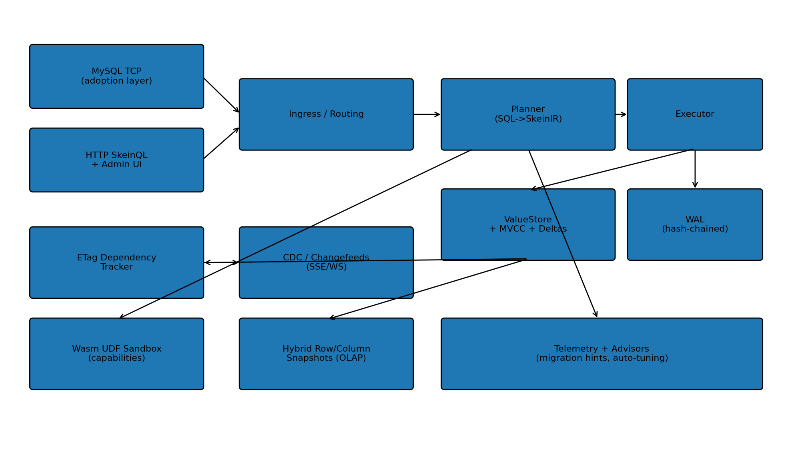

# SkeinDB

[](LICENSE)
[](https://github.com/sponsors/pinkysworld)
[](COMMERCIAL.md)

Last updated: 2026-05-09 (v0.3.8).

**SkeinDB is one binary, three protocols, and a stack of features that real production databases usually charge extra for.**

Run `skeindb serve` and you get a MySQL listener, a PostgreSQL listener, an HTTP/JSON-RPC control plane (SkeinQL), and a polished embedded admin console — all from a single executable, with no external dependencies and no separate proxy or sidecar to wire up.

What sets SkeinDB apart is what's already working under the hood:

- **Content-addressed deduplication out of the box.** Every value passes through a hash-keyed ValueStore. Live `dedup_ratio` and bytes-saved metrics are exposed in `stats.snapshot` and rendered live in the admin dashboard — no opt-in flag, no extra build.
- **Delta-chained values** keep similar payloads compact by storing only the diff against a base entry, with policy-driven chain-depth limits and compaction-time rebase.
- **MVCC time-travel reads.** Run `SELECT ... AS OF '2026-04-01T00:00:00Z'` or set `@@skein.as_of` and read the database as it was at any retained timestamp, with history retention/GC controllable at runtime.
- **Tamper-evident audit WAL.** A BLAKE3-256 hash chain plus checkpoint anchors plus Merkle inclusion proofs — verify the entire log with one RPC.
- **Dedup-preserving encryption.** Two AEAD modes (`ENC_RANDOM` and the convergent `ENC_MLE_DB`), key registration / rotation / re-encryption progress reporting, and a redacted in-memory audit ring — all driven from the SkeinAdmin Encryption panel.
- **Vector search** with an HNSW graph index (`vector.insert`, `vector.search`).
- **Differential privacy** with Rényi-DP composition tracking (`dp.*`).
- **Change Data Capture** over both polling and SSE, with bounded retention and `Last-Event-ID` reconnect semantics.
- **Replay bundles** export schema + retained row versions + change-event metadata into a deterministic, checksum-verified workspace you can run anywhere.
- **CAS-aware replication.** Replicas pull only the ValueIDs they're missing, with hash-verified `objects.fetch` and live hit-rate / saved-bytes reporting.
- **Query coalescing** so a thundering-herd of identical reads collapses to a single execution.
- **Self-tuning index advisor** that synthesizes candidate indexes from observed workload features and applies them with rollback on failure.
- **Migration intent reports** that detect common MySQL application idioms, preview SkeinQL-native rewrites, and export JSON/Markdown reports for offline review.
- **Plan cache + SQL autoparameterization** keyed by fingerprint × schema-version × session flags.
- **A click-first admin console** with a phpMyAdmin-inspired Easy Viewer, a WYSIWYG schema editor that diffs your edits into a previewable `ALTER TABLE` plan, and dedicated panels for CDC, time travel, replay, encryption, and forensics.

It runs the HTTP API, the admin UI, the MySQL wire listener, the PostgreSQL wire listener, and (optionally) the QUIC transport from the same binary. Default row persistence is segment-backed `.rseg`. The compatibility surface is exercised on every commit by a 1600-line MySQL corpus plus a live PostgreSQL roundtrip suite.

We're honest about the gaps too — see [What's still partial](#whats-still-partial) below, and [docs/TRUE_STATUS_MATRIX.md](docs/TRUE_STATUS_MATRIX.md) for the audited matrix. But the headline features above aren't aspirational: they ship in the binary, they're test-covered, and the dashboard shows them moving in real time.



---

## What's Working Today

- **One executable** runs the HTTP API, SkeinAdmin, the MySQL listener, and the optional PostgreSQL listener — no sidecars, no proxy, no separate console process.
- **MySQL compatibility** is the most mature adoption path. The 1600-line compatibility corpus covers DML, joins, aggregates, window functions, JSON functions, CTEs, UNION, GROUP BY, prepared statements, and more — and runs end-to-end on every commit.
- **WordPress-class workloads** are a first-class target: installer/admin query shapes are covered, and a live WordPress smoke test runs against the listener.
- **PostgreSQL v3** wire baseline with SCRAM-SHA-256 auth, simple + extended query protocol, virtual `pg_catalog`, transaction/savepoint state, and SQLSTATE-mapped errors.
- **SkeinAdmin** is a real embedded control panel: schema browsing, SQL workspaces, Easy Viewer with inline edit + WYSIWYG schema design, dashboards with live storage/dedup/MVCC/cache cards, settings + token/user management, telemetry, index-advisor workflows, CDC, time-travel, replay, encryption, and forensics.
- **SkeinQL** is the preferred native API: typed JSON-RPC over HTTP and QUIC.
- **Row persistence** defaults to segment-backed `.rseg` storage.

## What's Still Partial

- PostgreSQL support is real but still partial: COPY protocol, portal suspension, broader dialect/catalog parity, and production-grade driver matrices are still open. See [docs/PG_COMPAT.md](docs/PG_COMPAT.md).
- Eighteen research tracks (`R01`–`R20`) are hardened with evidence-backed tests, while `R18` and `R19` remain prototype-level. See [docs/TRUE_STATUS_MATRIX.md](docs/TRUE_STATUS_MATRIX.md).
- Clustering, CDC, snapshots, Wasm operators, and advisor flows are wired end-to-end; R19 now includes artifact inspection and host-backed edge packaging, while native Wasm codegen/SIMD still need hardening.
- SkeinDB does **not** claim 100% MySQL or PostgreSQL parity.

> Implementation note
> The current engine is usable and tested, but parts of the storage and research architecture are still evolving. The repo intentionally keeps shipped runtime behavior and forward-looking work next to each other so the gap is always visible.

---

## Current Status

- **MySQL:** broad compatibility layer with prepared statements, wide `COM_QUERY` coverage, compatibility shims for real application workloads, and corpus-backed regression coverage.
- **WordPress:** install/admin-style compatibility is far enough along to be used as a live smoke target, including Users and Site Health query coverage.
- **PostgreSQL:** partial PG v3 baseline with trust/SCRAM-SHA-256 auth, managed DB-user passwords, SSL rejection, startup probes, simple + extended query protocol, virtual `pg_catalog`, SQLSTATE-mapped errors, and failed-transaction blocking.
- **Admin/UI:** SkeinAdmin is no longer a placeholder; it is an active part of the product surface. Easy Viewer now ships a **WYSIWYG schema editor** (Easy Viewer → Design tab) that diffs your in-browser edits against the live table and emits a `ALTER TABLE` plan you can preview before applying.
- **Encryption:** dedup-preserving encryption baseline (Phase 20) is shipped — `EncryptedValueStore` provides `put_encrypted` / `get_decrypted` / `reencrypt_value` over the existing storage format, `DatabaseKeyManager::rotate_active_key` returns a `KeyRotationPlan`, and `settings.encryption.*` JSON-RPC + a SkeinAdmin **Encryption** panel expose the operator surface (master keys live only in process memory; re-register on restart).
- **Storage:** default row persistence is `segment` mode using `.rseg`, with fallback/hybrid support still present.
- **CLI:** `skeindb version` prints a runtime banner with format and dialect doc pointers; `skeindb info --data ./data [--json]` summarises catalog state, storage mode, and default ports for ops use; `skeindb serve` prints a startup banner with the resolved data dir, storage mode, and listener URLs (HTTP / SkeinAdmin / MySQL / PostgreSQL / QUIC / cluster).
- **Status tracking:** the authoritative runtime truth lives in `docs/TRUE_STATUS_MATRIX.md`, with the roadmap in `docs/PROJECT_BACKLOG.md`.

If you want the most honest snapshot of what is implemented versus planned, start here:

- `docs/TRUE_STATUS_MATRIX.md`
- `docs/PROJECT_BACKLOG.md`
- `docs/MYSQL_COMPAT.md`
- `docs/PG_COMPAT.md`

---

## Why Use It

Pick SkeinDB if you want any of these:

- **One binary, no setup tax.** Drop it on a box, run `serve`, and you've got MySQL + PostgreSQL + JSON-RPC + admin UI. No package matrix, no separate dashboard service.
- **Storage features built in.** Dedup, delta chaining, MVCC, time travel, audit WAL, dedup-preserving encryption, and vector search are all in the same binary — toggleable from a UI checkbox, not a 200-line YAML file.
- **An admin console you'll actually open.** Easy Viewer, WYSIWYG schema editor, live dashboards, click-first CDC and replay flows. No phpMyAdmin install, no Grafana wiring.
- **Honest engineering.** The repo keeps runtime, backlog, and docs in lockstep. `docs/TRUE_STATUS_MATRIX.md` shows you what's hardened vs. prototype. We don't ship marketing claims the tests don't back.
- **A MySQL adoption target** with a corpus-backed compatibility surface and live WordPress smoke coverage.
- **A research-friendly base.** ETags + If-None-Match, query coalescing, plan cache, autoparameterization, differential privacy, oblivious execution, Wasm UDFs, and replay bundles are all directly addressable.

---

## Quick Start

### Install

Homebrew:

```bash
brew tap pinkysworld/skeindb https://github.com/pinkysworld/SkeinDB
brew install --HEAD pinkysworld/skeindb/skeindb
```

Tagged `v*` releases update the repo-local Homebrew formula automatically, after which the stable path is:

```bash
brew install pinkysworld/skeindb/skeindb
```

apt-get:

```bash
sudo curl -fsSL https://raw.githubusercontent.com/pinkysworld/SkeinDB/apt/pubkey.gpg \
  -o /usr/share/keyrings/skeindb-archive-keyring.gpg
echo "deb [signed-by=/usr/share/keyrings/skeindb-archive-keyring.gpg] https://raw.githubusercontent.com/pinkysworld/SkeinDB/apt stable main" \
  | sudo tee /etc/apt/sources.list.d/skeindb.list >/dev/null
sudo apt-get update
sudo apt-get install skeindb
```

The apt repository is published by the tag-driven release workflow once the signing secrets are configured.

### Build

```bash
cargo build --release
```

### Run

```bash
./target/release/skeindb serve --data ./data --http 8080 --mysql 3306
```

With PostgreSQL enabled:

```bash
./target/release/skeindb serve --data ./data --http 8080 --mysql 3306 --pg 5432
```

Optional storage mode override:

```bash
./target/release/skeindb serve --data ./data --http 8080 --mysql 3306 --storage-mode hybrid
```

Default row persistence without an explicit flag is `segment`, which stores table rows in `.rseg` files and falls back to `.json` on read when needed.

Open:

- SkeinAdmin: `http://127.0.0.1:8080/admin`
- SQL workspace: `http://127.0.0.1:8080/console`
- SkeinQL JSON-RPC: `http://127.0.0.1:8080/api/v1/rpc`

See `docs/GETTING_STARTED.md` for a fuller walkthrough.

---

## Main Surfaces

### MySQL

- MySQL wire listener on `--mysql`
- `mysql_native_password` handshake/auth flow
- broad translated SQL subset
- prepared-statement support
- compatibility coverage aimed at real application workloads, especially WordPress-shaped traffic

See `docs/MYSQL_COMPAT.md`.

### PostgreSQL

- PG v3 startup/auth handshake
- common startup/bootstrap query handling
- simple query protocol
- failed transaction state in the simple-query path

See `docs/PG_COMPAT.md`.

### SkeinQL

- JSON-RPC control plane over HTTP
- schema, query, transaction, admin, telemetry, cluster, and research-oriented surfaces

See `docs/SKEINQL.md`.

### SkeinAdmin

- embedded admin and console routes
- schema/data/sql workflows
- Easy Viewer for click-first table work
- settings, telemetry, security, and advisor panels

See `docs/SKEINADMIN.md`.

---

## Repository Layout

```text
crates/
  skeindb/          # server, protocol layers, execution engine
  skeindb-core/     # stable low-level primitives
  skeindb-ir/       # shared IR types
  skeindb-skeinql/  # SkeinQL request/response and method schemas
web/
  console/          # minimal embedded SQL console sources
  skeinadmin/       # embedded admin UI sources
docs/               # operator docs, specs, compatibility notes, backlog
tests/compat/       # MySQL compatibility corpus and regressions
site/               # generated public landing page
```

---

## Verification

Standard checks from the workspace root:

```bash
cargo fmt --all
cargo clippy --all-targets --all-features -- -D warnings
cargo test --locked
```

Note: strict `clippy -D warnings` is still not clean repo-wide today; use `docs/TRUE_STATUS_MATRIX.md` and current CI/local output as the source of truth for that status.

## Release Packaging

Tagged releases now drive the install surfaces:

- `vX.Y.Z` tags build a source tarball, a Linux `amd64` tarball, and a Debian package.
- The same workflow renders a stable `Formula/skeindb.rb` entry in this repo for the Homebrew tap.
- If `APT_GPG_PRIVATE_KEY`, `APT_GPG_KEY_ID`, and the optional `APT_GPG_PASSPHRASE` GitHub Actions secrets are configured, the workflow also publishes a signed apt repository to the `apt` branch.
- See `docs/RELEASE_PACKAGING.md` for the optional apt-signing behavior and why the checked-in formula can lag until the tag workflow completes.

---

## Documentation

Start here:

- `docs/README.md`

Most useful day-to-day docs:

- `docs/GETTING_STARTED.md`
- `docs/MYSQL_COMPAT.md`
- `docs/PG_COMPAT.md`
- `docs/SKEINQL.md`
- `docs/SKEINADMIN.md`
- `docs/ON_DISK_FORMAT.md`
- `docs/TRUE_STATUS_MATRIX.md`
- `docs/PROJECT_BACKLOG.md`

---

## Support

If SkeinDB is useful to you and you want to help keep it moving:

- GitHub Sponsors is the main option: <https://github.com/sponsors/pinkysworld>
- If PayPal is easier, you can use `mip@gmx.biz` (or <https://www.paypal.com/paypalme/mippinky>).

For teams running SkeinDB in production we publish indicative support plans
(Starter €299 / Business €1,200 / Enterprise €3,900) plus custom and 24×7
engagement options. See the full tier table, add-ons, and FAQ on
[site/pricing.html](site/pricing.html), the contact form on
[site/contact.html](site/contact.html), or the long-form overview in
[COMMERCIAL.md](COMMERCIAL.md).

See [SUPPORT.md](SUPPORT.md) for a shorter community-support overview.

---

## License

SkeinDB is licensed under the Apache License 2.0. See `LICENSE`.
