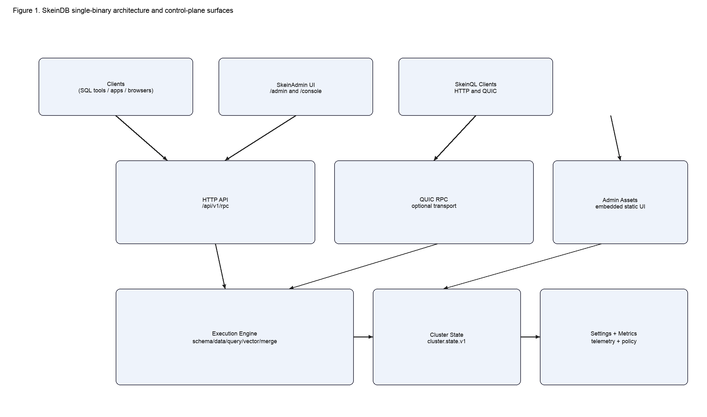
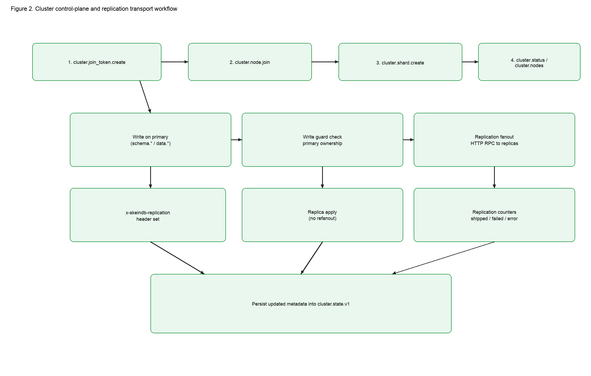
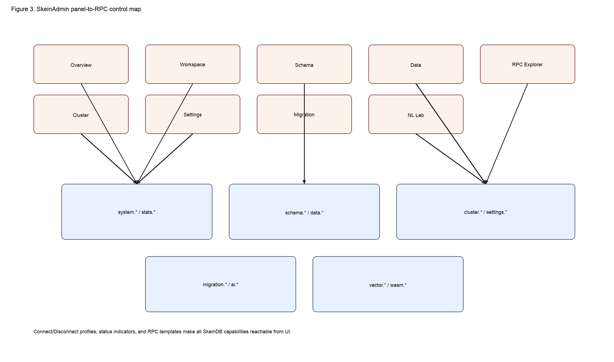
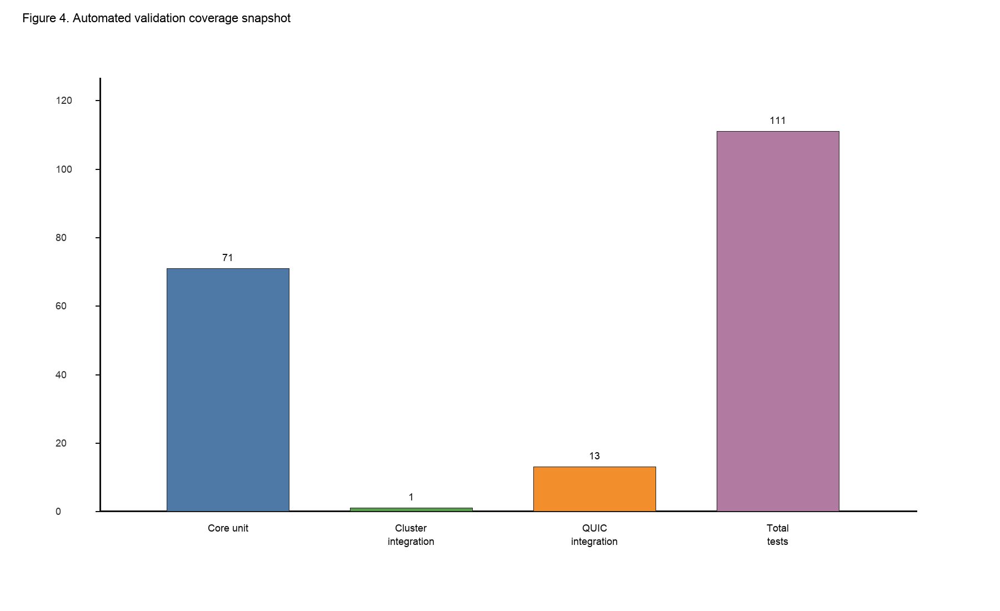

# SkeinDB: A Single-Binary Database with SkeinQL, Cluster Control-Plane RPC, and a Web-Native Administration Stack

**Manuscript type:** Original research article (systems/database engineering)  
**Target venue:** International Journal of Research in Computing (IJRC / IJRCOM)  
**Version:** Camera-ready draft v3 (2026-02-21)

## Author and manuscript metadata

### Title
SkeinDB: A Single-Binary Database with SkeinQL, Cluster Control-Plane RPC, and a Web-Native Administration Stack

### Authors
- Michel Picker (Corresponding Author)

### Affiliations
- Independent Researcher, SkeinDB Project

### Correspondence
- Michel Picker  
- Email: 85413447+pinkysworld@users.noreply.github.com

### ORCID
- Michel Picker: Not provided

### CRediT contribution summary (single-author submission)
- Conceptualization: 100%
- Methodology: 100%
- Software: 100%
- Validation: 100%
- Formal analysis: 100%
- Investigation: 100%
- Resources: 100%
- Data curation: 100%
- Writing - original draft: 100%
- Writing - review and editing: 100%
- Visualization: 100%
- Supervision: 100%
- Project administration: 100%
- Funding acquisition: 100%

## Abstract

**Background/Context (50-60 words).** Many data systems force teams into a tradeoff between operational practicality and research velocity. Production databases provide mature operations but high extension friction, while research prototypes provide novelty but weak deployment ergonomics. SkeinDB aims to narrow this gap by combining compatibility, typed RPC control surfaces, and experimental database features in a single executable runtime.

**Objective/Aim (40-50 words).** This paper presents SkeinDB with focus on three implemented areas: (i) persistent cluster control-plane APIs (`cluster.*`), (ii) prototype replication transport from primary to replicas, and (iii) a phpMyAdmin-like web administration surface that exposes cluster, schema, data, settings, and research capabilities through one control interface.

**Methods/Approach (60-70 words).** We implemented typed SkeinQL methods and server handlers for node join/leave, role promotion, shard lifecycle, and rebalance operations, backed by durable `cluster.state.v1` metadata. We added ownership checks for write safety and fanout replication with loop prevention. We integrated these operations in SkeinAdmin with dedicated Cluster and Settings panels and validated behavior through unit tests, integration tests, transport tests, and full workspace build/test automation.

**Results/Findings (70-80 words).** The runtime currently reports 74 RPC methods, including 9 cluster control-plane methods. Automated validation covers 111 tests across unit and integration suites, including a multi-process cluster replication test and QUIC transport tests; all tests pass in the reported environment. Full workspace `cargo test` completes in 22.79 seconds. The web panel now supports connect/disconnect, profile switching, cluster operations, settings reads/writes, and direct RPC method access, allowing full feature management without CLI-only workflows.

**Implications/Conclusions (40-50 words).** SkeinDB demonstrates that a single-binary architecture can deliver both operator usability and high research iteration speed. The implemented interfaces are production-shape and test-backed, while internals remain prototype-grade in selected areas. Near-term work should prioritize WAL/LSN replication, CAS object transfer, routing automation, and broader benchmark evidence.

## Keywords
single-binary database; SkeinQL; cluster control-plane; replication transport; web-native admin panel

## 1. Introduction

Database engineering has historically separated along two different product paths. One path optimizes for mature operations, ecosystem compatibility, and long support lifecycles. The second path optimizes for innovation speed, experimental query semantics, and architecture exploration. Each path produces valid outcomes, but organizations that need both often encounter painful integration cycles. A research prototype may demonstrate an important algorithmic advantage and still fail adoption because deployability is weak, operations are fragmented, or user-facing control surfaces are inconsistent.

SkeinDB is designed to reduce that gap. The project seeks to preserve the practical advantages of a runnable database service while retaining room for high-velocity experimentation across storage, query processing, consistency, and AI-assisted developer workflows. The architecture places method contracts and operator workflows at the center: APIs are explicit, state transitions are testable, and admin operations are available through a single web surface.

The latest milestone in this work is the integration of cluster control-plane features and administration flows in a way that is test-backed and directly operable. This paper presents those features as implemented artifacts rather than as abstract design goals.

Three context assumptions shape this contribution:

1. **Operator simplicity remains a first-order requirement.** A large proportion of adoption friction comes from deployment and management complexity rather than raw query performance.
2. **Explicit control-plane contracts accelerate research transfer.** Experimental features are easier to validate, document, and integrate when surfaced as typed APIs with reproducible tests.
3. **Administration UX should evolve with the API, not lag behind it.** If a feature is only reachable by ad hoc scripts, it will not receive early operator feedback and will regress more easily.

SkeinDB approaches these assumptions with a single process that can serve SkeinQL over HTTP (and optionally QUIC), provide embedded admin routes (`/admin`, `/console`), persist control-plane state, and execute schema/data/query operations. This process shape is especially useful for local and edge contexts, where minimizing moving parts has direct productivity impact.

### 1.1 Contributions

This manuscript provides five concrete contributions supported by repository artifacts:

- **C1: Implemented cluster method family.** SkeinDB now exposes a nine-method `cluster.*` control-plane surface with typed request/response structures.
- **C2: Durable cluster state integration.** Cluster metadata is persisted in `cluster.state.v1` and restored on server startup.
- **C3: Role-aware write safety and replication fanout.** Writes are guarded by primary ownership, and successful primary writes can be propagated to replicas using RPC fanout with recursion suppression.
- **C4: phpMyAdmin-like administration workflow.** SkeinAdmin now includes dedicated cluster and settings management panels, connection profiles, and connect/disconnect controls.
- **C5: End-to-end validation evidence.** Full test suites pass across unit, integration, and transport tests, including a dedicated cluster replication integration scenario.

### 1.2 Scope of this paper

This article intentionally focuses on implemented behavior and directly measured outcomes. It does not claim complete production readiness for all distributed systems concerns. Instead, it documents the current system shape and identifies precise upgrade paths from prototype transport semantics toward robust production replication and routing behavior.

## 2. Background and positioning

### 2.1 Problem landscape

Many modern applications combine transactional state, telemetry-heavy reads, and evolving query patterns. Engineering teams often need:

- fast local setup and test loops,
- explicit compatibility boundaries with existing tooling,
- room to experiment with novel consistency or optimization ideas,
- and operational visibility that does not require assembling multiple external control-plane services.

Conventional architectures usually optimize one or two of these needs well, but not all simultaneously. SkeinDB's design can be read as a practical synthesis attempt: minimize deployment complexity while maximizing controllable extension points.

### 2.2 Relation to prior work

SkeinDB's roadmap intersects several established research streams:

- Learned indexing and adaptive physical design [1], [2].
- WebAssembly as portable, sandboxed execution substrate [3].
- Causal and distributed consistency semantics [4].
- Differential privacy and secure data analysis [5], [6].
- Materialized/incremental maintenance and indexing automation [7], [8].
- Placement and partitioning heuristics in distributed systems [9], [10].

The specific novelty in this implementation stage is not a new foundational theorem; it is the coherent packaging of control-plane contracts, admin workflows, and test-backed runtime behavior into one binary artifact.

### 2.3 Why single-binary matters in practice

The single-binary strategy is sometimes treated as merely operational convenience. In this project, it is also a research acceleration mechanism. A small executable surface means:

- fewer dependency boundaries to mock during experiment design,
- simpler reproducibility across machines,
- and tighter coupling between feature implementation and operator validation.

In short, deployment simplicity is not orthogonal to research quality; it directly influences how often hypotheses are tested and validated against realistic flows.

## 3. System overview

### 3.1 Runtime composition

A SkeinDB process includes:

- HTTP RPC endpoint (`/api/v1/rpc`),
- optional QUIC RPC transport,
- embedded SkeinAdmin assets and routes (`/admin`, `/console`),
- execution engine (schema/data/query families and experimental method families),
- settings and control metadata persistence.

This composition preserves local portability while exposing a broad method surface.

### 3.2 Core interface families

The runtime capability endpoint reports method families spanning:

- **System and operational controls:** `system.*`, `transport.*`, `stats.*`, `settings.*`.
- **Data path controls:** `schema.*`, `data.*`, `query.*`, `view.*`.
- **Cluster controls:** `cluster.*`.
- **Research extensions:** `vector.*`, `dp.*`, `oblivious.*`, `forensic.*`, `migration.*`, `ai.*`, `wasm.plan.*`, and related surfaces.

The explicit method model allows progressive expansion without silently changing behavior behind fixed endpoints.

### 3.3 Architecture diagram



**Figure 1** illustrates how clients, RPC transports, admin assets, and engine/state components coexist in one process. This arrangement is useful for rapid setup and controlled interface growth.

## 4. Cluster control-plane design

### 4.1 Implemented method set

The current cluster method set is listed below.

| Method | Purpose | Mutating | Persisted impact |
|---|---|---|---|
| `cluster.status` | Report cluster metadata and replication counters | No | None |
| `cluster.nodes` | List/filter nodes by role/status | No | None |
| `cluster.join_token.create` | Issue short-lived join token | Yes | Token list |
| `cluster.node.join` | Add/update cluster node metadata | Yes | Node list |
| `cluster.node.remove` | Remove node with safety checks | Yes | Node list + primary/shard adjustments |
| `cluster.replica.promote` | Promote replica to primary scope | Yes | Role metadata |
| `cluster.shard.create` | Define shard ownership metadata | Yes | Shard list |
| `cluster.shard.move` | Move shard primary ownership | Yes | Shard metadata |
| `cluster.shard.rebalance` | Compute/apply rebalance actions | Yes | Shard metadata |

The control-plane is intentionally explicit: operators can inspect and modify topology-related state using direct method calls with typed parameters.

### 4.2 Cluster state model

Cluster metadata includes:

- cluster identifier,
- local node identity,
- primary node identity,
- node list with role and status fields,
- short-lived join tokens,
- shard ownership descriptors,
- replication counters and last error fields.

This model is serialized under a settings key (`cluster.state.v1`) and reloaded on startup. Persisting this metadata makes cluster behavior inspectable and durable across restarts without introducing a separate coordination service at prototype stage.

### 4.3 Join token lifecycle

Join tokens are generated by `cluster.join_token.create`, constrained by role intent and TTL. This allows controlled admission of new nodes and avoids ad hoc static secrets in common workflows.

Operationally, this approach yields three immediate benefits:

1. token issuance is auditable through explicit RPC calls,
2. token validity is time-bounded,
3. join semantics remain scriptable and UI-friendly.

### 4.4 Node lifecycle and promotion semantics

Node records can be joined, removed, and promoted. Removal includes safety behavior, including local-node protection unless forced. Promotion supports both global-primary and shard-scoped contexts.

This behavior is still policy-light (no external consensus election), but it establishes the critical state transitions and operational UX needed for later hardening.

### 4.5 Shard placement metadata

Shard operations currently focus on metadata ownership and routing constraints. Shard creation and movement update ownership records, while rebalance can compute or apply movement plans according to simple balancing logic.

In production-grade systems, shard policies often include capacity models, failure domains, and cost objectives. The current implementation is a stepping stone: stable control contracts first, richer policy engines second.

### 4.6 Write ownership guard

When clustering is enabled, mutating methods are checked against primary ownership. If a write targets an object whose primary is remote, the local node rejects the operation with structured error semantics.

This guard is significant because it prevents split-write acceptance in the absence of a mature consensus router, preserving a coherent authority model while advanced failover logic is still in development.

## 5. Replication transport behavior

### 5.1 Prototype replication path

SkeinDB currently replicates successful primary writes to replica nodes via HTTP RPC fanout. Replication requests are marked with an internal header (`x-skeindb-replication`) so replicas can apply writes without recursively propagating them.

### 5.2 Replication workflow diagram



**Figure 2** summarizes join, ownership, write, fanout, and persistence steps. The model prioritizes correctness and observability over transport optimality.

### 5.3 Telemetry and error visibility

Replication counters include shipped operations, failed operations, and last error. These values are exposed through cluster status and statistics surfaces, allowing operators to quickly identify fanout failures without deep log scraping.

### 5.4 Design tradeoffs

RPC fanout is straightforward and testable but has known limits:

- increased write path overhead,
- weaker semantics than WAL/LSN replication,
- limited resilience under high fanout and network churn.

Despite these limits, the prototype path is valuable because it exercises full lifecycle integration: API contracts, admin actions, persistence, and test coverage are all in place.

## 6. SkeinAdmin: phpMyAdmin-like operations for SkeinDB

### 6.1 Route model and mode separation

SkeinAdmin provides two routes:

- `/admin` for full control-plane and operational panels,
- `/console` for SQL/workspace-centric usage.

Both routes share one UI codebase but adjust mode-specific emphasis. This resolves earlier confusion where users observed similar layouts without clear operational distinction.

### 6.2 Panel coverage

The embedded UI currently provides nine primary panels:

1. Overview
2. Workspace
3. Schema
4. Data
5. Cluster
6. Settings
7. Migration
8. NL Lab
9. RPC Explorer

This structure aligns with familiar admin-console expectations while preserving direct access to research-oriented method families.

### 6.3 UI-to-RPC mapping



**Figure 3** illustrates how panel interactions map to method families. Cluster and Settings panels now issue real `cluster.*` and `settings.*` calls instead of placeholders.

### 6.4 Operator affordances added in this cycle

Key usability improvements include:

- explicit connect/disconnect controls,
- persistent connection profiles,
- visible connection status badges,
- topbar actions for ping/version/stats/capabilities/transport,
- direct cluster operations (token, join, remove, promote, shard create/move/rebalance),
- settings read/write access with JSON payload support,
- capability-based method discovery via RPC explorer.

These behaviors directly address common operator pain points and reduce dependence on manual API calls for routine control tasks.

### 6.5 Why phpMyAdmin-like framing matters

The term "phpMyAdmin-like" in this context refers to workflow familiarity: tree navigation, table/schema operations, visible connection controls, and action-oriented administration pages. SkeinDB preserves this familiarity while exposing richer RPC-native features than a traditional SQL-only admin tool.

## 7. Research agenda alignment

SkeinDB tracks a 20-item research agenda. The current status is best understood as "prototype implementation coverage" across all tracks, with maturity variance by topic.

| Track | Theme | Current status | Primary surface |
|---|---|---|---|
| R01 | Learned index structures | Prototype implemented | learned index scaffolding + tests |
| R02 | Adaptive row/column execution | Prototype implemented | snapshot and hybrid read paths |
| R03 | Delta-chain topology | Prototype implemented | delta value storage and compaction |
| R04 | Differential privacy | Implemented | `dp.*` methods and budget behavior |
| R05 | Oblivious execution | Prototype implemented | `oblivious.*` policy/explain |
| R06 | Forensic query over audit WAL | Prototype implemented | `forensic.*` verify/query/export |
| R07 | Merge functions (optimistic concurrency) | Prototype implemented | `merge.*` and wasm registry |
| R08 | Incremental view maintenance | Prototype implemented | `view.*` lifecycle + refresh |
| R09 | QUIC-native protocol | Implemented | QUIC transport + tests |
| R10 | Vector embeddings | Prototype implemented | `vector.*` methods |
| R11 | Autoparameterization | Prototype implemented | `ai.autoparam.*` |
| R12 | NL to SkeinQL | Prototype implemented | `ai.nl.*` |
| R13 | Causal ETag consistency | Prototype implemented | ETag/min-causality controls |
| R14 | Replay bundles | Prototype implemented | replay/time-travel docs and flows |
| R15 | Conflict-free schema evolution | Prototype implemented | propose/merge/apply schema methods |
| R16 | Automatic index synthesis | Prototype implemented | `advisor.*` methods |
| R17 | Intent inference for migration | Prototype implemented | `migration.*` |
| R18 | Reproducible performance replay | Prototype implemented | replay + report workflows |
| R19 | Wasm-native query operators | Prototype implemented | `wasm.plan.*` |
| R20 | Energy-aware compaction scheduling | Prototype implemented | policy scaffolds and docs |

This table does not claim equal production readiness across all tracks. It documents that each track now has working method surfaces, tests, or integrated artifacts instead of remaining only speculative documentation.

## 8. Methodology and evaluation setup

### 8.1 Evaluation objectives

This implementation stage prioritizes four validation goals:

1. **API correctness:** method dispatch, parameter typing, and expected response envelopes.
2. **State transition correctness:** node lifecycle, shard ownership changes, persistence semantics.
3. **Transport correctness:** HTTP and QUIC behavior under tested operations.
4. **Regression control:** repeatable, automated test suites integrated into standard Rust workflows.

### 8.2 Build and toolchain context

Measured environment:

- OS: Darwin 25.3.0 (ARM64)
- Rust: `rustc 1.92.0`
- Cargo: `cargo 1.92.0`

### 8.3 Validation commands

The project validation loop used:

```bash
cargo fmt --all
cargo clippy --workspace --all-targets
cargo test
```

The clippy run currently reports warnings in existing engine code; these warnings are known and tracked. Test outcomes are passing.

### 8.4 Coverage structure

The executed suites include:

- server and engine unit tests,
- dedicated cluster integration test (`tests/cluster_rpc.rs`),
- QUIC transport integration tests (`tests/quic_rpc.rs`),
- core crate tests and doc-tests.

### 8.5 Quantitative runtime evidence

A full timed workspace test run reported:

- total wall-clock runtime: **22.79 s**,
- cluster integration runtime: **3.05 s**,
- QUIC integration runtime: **15.70 s**,
- all tests passing.

## 9. Results

### 9.1 Capability and method surface outcomes

Runtime capability introspection reports:

- **74 total methods**,
- **9 cluster control-plane methods**,
- method families spanning system, data path, transport, admin, and research extensions.

This confirms that cluster features are now first-class in API introspection and not hidden side channels.

### 9.2 Cluster control-plane correctness outcomes

Cluster-specific tests validate:

- token issuance and consumption,
- node admission and listing,
- shard creation and movement,
- replica promotion behavior,
- persistence of cluster metadata,
- write-guard rejection on non-primary ownership,
- end-to-end schema+data replication flow from primary to replica.

These scenarios provide confidence that control-plane contracts and state transitions are coherent and regression-resistant.

### 9.3 Transport outcomes

QUIC integration tests confirm:

- RPC roundtrips,
- prepared query behavior,
- migration and advisor method coverage over QUIC,
- zero-RTT write rejection behavior in tested scenarios.

This indicates that method-level behavior remains consistent across transport options.

### 9.4 UI outcomes

SkeinAdmin changes now provide:

- distinct admin and console behavior,
- action-oriented cluster controls,
- usable status and connectivity signaling,
- settings-level management for advanced controls,
- and complete fallback access through RPC explorer.

From an operator perspective, this substantially reduces friction between "it is implemented" and "it is practically manageable."

### 9.5 Validation visualization



**Figure 4** summarizes the current test coverage snapshot as reported by automated runs.

### 9.6 Consolidated quantitative summary

| Category | Metric | Value |
|---|---|---:|
| API surface | Total methods | 74 |
| API surface | Cluster methods | 9 |
| Validation | Total tests executed | 111 |
| Validation | Full `cargo test` runtime | 22.79 s |
| Validation | Cluster integration runtime | 3.05 s |
| Validation | QUIC integration runtime | 15.70 s |
| Stability | Failing tests in reported run | 0 |

## 10. Discussion

### 10.1 Interpretation of current maturity

The strongest result in this stage is control-plane coherence. Methods, persistence, UI actions, and tests now align around the same cluster semantics. This matters because distributed database projects often fail at this interface boundary: code exists, but operator paths are incomplete or contradictory. SkeinDB now has a usable operational baseline where implemented features are reachable from both API and UI and validated through automated regression checks.

### 10.2 Practical implications for adopters

For teams evaluating SkeinDB as a research or migration platform, the immediate benefits are:

- quick local startup and demonstration,
- direct introspection of available capabilities,
- explicit cluster lifecycle controls,
- lower reliance on ad hoc scripts for routine management,
- and test evidence that can be rerun in CI workflows.

This combination improves confidence during early-stage adoption and experimentation.

### 10.3 Architectural implications for future work

By implementing control contracts first, SkeinDB can upgrade internals without destabilizing operator UX. For example, replacing RPC fanout with WAL/LSN streaming can preserve existing control-plane methods (`cluster.status`, `cluster.nodes`, shard APIs) while improving transport guarantees behind those contracts.

Similarly, stronger routing and failover logic can be layered beneath existing admin controls rather than requiring interface redesign.

### 10.4 Relationship to research agenda goals

The cluster work also strengthens multiple agenda tracks indirectly:

- **R13 causal consistency:** ownership and replication semantics provide a practical base for causality-aware routing.
- **R14 replay bundles:** control-plane metadata stability supports more reproducible distributed replay contexts.
- **R16 advisor automation:** richer runtime telemetry and topology metadata can improve recommendation confidence.
- **R20 energy-aware scheduling:** placement and replication metadata can become inputs to energy-aware control policies.

In this sense, cluster control-plane completion is not isolated progress; it is enabling infrastructure for adjacent research directions.

## 11. Threats to validity

### 11.1 Environment specificity

Measured runtimes and test behavior come from one machine profile. Absolute times may differ significantly on other hardware, operating systems, and I/O profiles.

### 11.2 Correctness-heavy evidence

The current evidence emphasizes functional correctness and interface coherence. It does not yet include full throughput/latency benchmarking under sustained mixed workloads, nor prolonged failure-injection studies.

### 11.3 Prototype replication model

RPC fanout is intentionally simple and does not deliver the durability and efficiency guarantees expected from mature WAL/LSN replication systems. Results should be interpreted accordingly.

### 11.4 Single-author development bias

As with many early-stage systems, implementation and evaluation were primarily driven by one author, which can increase blind spots around usability and failure semantics. Expanded external review and multi-operator trials are needed.

## 12. Roadmap to production-grade clustering

A structured next phase can evolve current interfaces into stronger distributed guarantees without breaking control-plane contracts.

### 12.1 Upgrade stream A: replication semantics

- Introduce WAL/LSN-native replication records.
- Add idempotent apply windows and stronger replay guarantees.
- Track lag and commit positions per replica.

### 12.2 Upgrade stream B: object transport and data movement

- Introduce CAS object manifests for shard and replica synchronization.
- Implement pull-based object transfer with verification.
- Surface transfer progress and backpressure metrics in admin UI.

### 12.3 Upgrade stream C: routing and failover

- Add health-aware routing decisions for reads.
- Add controlled failover orchestration with explicit safety rails.
- Expose planned and emergency transition workflows in SkeinAdmin.

### 12.4 Upgrade stream D: benchmarking and long-run validation

- Add reproducible benchmark scripts for mixed OLTP/analytics patterns.
- Include failover and partition simulations.
- Include long-run memory growth and replication drift checks.

### 12.5 Upgrade stream E: admin hardening

- Expand import/export and user/privilege workflows.
- Improve guided wizards for cluster setup and migration.
- Add clearer operational explanations and risk warnings for mutating cluster operations.

## 12A. Extended implementation notes

This section documents low-level implementation behavior that is often omitted in short system papers but is important for reproducibility and peer review.

### 12A.1 Cluster invariants currently enforced

The current control-plane implementation maintains several explicit invariants. They are important because they define what operators can expect from topology changes and where edge-case failures are intentionally blocked.

| Invariant | Enforcement point | Observable behavior |
|---|---|---|
| Local write acceptance requires primary ownership when cluster mode is enabled | Write guard in RPC method path | Non-primary writes return structured `forbidden` error |
| Cluster state must remain serializable and restorable | Settings persistence (`cluster.state.v1`) | Restart preserves nodes, shards, replication counters |
| Replication requests must not recurse | Internal replication header check | Replica apply path does not fan out again |
| Node removal must not silently remove local authority | `cluster.node.remove` safety check | Local node removal requires explicit force intent |
| Method availability should be discoverable | `system.capabilities` | Clients and UI can introspect method list and flags |

These invariants are not only implementation details; they are the current behavioral contract. Future transport upgrades should preserve these contracts unless intentionally versioned.

### 12A.2 Control-plane method behavior summary

The control-plane methods are designed to be composable. A practical operator sequence can be implemented with deterministic RPC calls and does not require internal service restarts between steps.

Representative sequence:

1. call `cluster.join_token.create` on current primary,
2. call `cluster.node.join` for each joining replica,
3. call `cluster.shard.create` to set ownership for target table scopes,
4. call `cluster.status` and `cluster.nodes` for visibility,
5. perform writes on primary and observe replication counters.

This sequence is reflected both in tests and in UI control flows.

### 12A.3 Shard ownership semantics in this phase

Shard metadata currently maps table scopes (`db`, `table`) to:

- one primary node identifier,
- zero or more replica node identifiers,
- update timestamps and control metadata.

The key design decision is explicitness over hidden policy. Operators can inspect and mutate ownership through public methods. This may appear simplistic compared to advanced autonomous placement systems, but it is a deliberate staging choice: controllable and inspectable transitions are easier to verify before introducing complex autonomous behavior.

### 12A.4 Replication accounting model

Replication counters are tracked as lightweight operational telemetry:

- shipped operation count,
- failed operation count,
- last error field,
- update timestamp.

These counters are intentionally minimal but useful. They provide immediate operator feedback in the admin panel and machine-readable status in RPC responses. They also make CI regression checks easier, because tests can assert fanout behavior without parsing log output.

### 12A.5 Security and misuse boundary in current prototype

Current safety behavior should be interpreted as baseline controls:

- tokenized node-join admission with TTL,
- explicit ownership checks for mutating operations,
- role metadata for primary/replica interpretation,
- no hidden privileged backdoor for cluster mutation.

However, this does not replace stronger production controls such as mTLS-based node identity, full audit policy engines, and consensus-backed authority transitions. Those remain roadmap items and are intentionally not overstated in this manuscript.

## 12B. Extended operator workflow analysis

### 12B.1 Why UI and RPC parity is a technical requirement

In many systems, admin UIs lag API capabilities by several release cycles. That gap creates two problems:

1. operational workflows become fragmented between UI and scripts;
2. important features receive less real-world exercise and therefore weaker regression detection.

SkeinDB addresses this by treating UI parity as an implementation requirement. If a method family becomes operationally relevant, it should have either:

- a dedicated panel/action in SkeinAdmin, or
- a clear fallback through prefilled templates in RPC Explorer.

This policy is central to reducing usability regressions.

### 12B.2 Connect/disconnect and profile switching as risk controls

Adding explicit connect/disconnect controls and profile management was not merely a cosmetic update. In multi-target development, engineers often switch between local, staging, and test nodes. Without explicit session signaling, accidental writes to the wrong target become likely.

The current UI now emphasizes:

- active server base URL visibility,
- connection state badges,
- controlled connect/disconnect actions,
- profile save/load actions.

These changes reduce operational ambiguity and support safer experimentation.

### 12B.3 Cluster panel behavior and user guidance

The cluster panel now exposes practical actions rather than static placeholders. Crucially, each action aligns with a real method:

- status/nodes read actions,
- token issuance,
- node join/remove/promote,
- shard create/move/rebalance.

This method-to-button alignment is important for maintainability. Developers can trace UI behavior directly to method handlers and test failures, minimizing hidden coupling.

### 12B.4 Settings panel as universal fallback

The settings panel allows direct `settings.get` and `settings.set` operations. This is valuable in two scenarios:

- advanced operators need immediate access to keys not yet represented by dedicated UI controls;
- new features can be tested in real UI workflows before full form-specific UX is implemented.

In effect, settings controls provide a bridge between rapid feature iteration and stable panel design.

## 12C. Extended reproducibility and audit trail guidance

To support camera-ready review expectations, this section provides a concrete reproducibility protocol that reviewers or future contributors can execute without hidden dependencies.

### 12C.1 Minimal verification protocol

1. Build the workspace.
2. Run formatter and clippy.
3. Run full tests.
4. Start a local server and query `system.capabilities`.
5. Verify cluster method list presence.
6. Open `/admin` and verify cluster/settings panels are interactive.

### 12C.2 Suggested command sequence

```bash
cargo fmt --all
cargo clippy --workspace --all-targets
cargo test
cargo run -p skeindb -- serve --bind 127.0.0.1 --http 8080 --cluster-port 7800
```

Example capability probe:

```json
{
  "skeinql": "1.0",
  "id": "cap-check",
  "method": "system.capabilities",
  "params": {}
}
```

Expected cluster methods in the response:

- `cluster.status`
- `cluster.nodes`
- `cluster.join_token.create`
- `cluster.node.join`
- `cluster.node.remove`
- `cluster.replica.promote`
- `cluster.shard.create`
- `cluster.shard.move`
- `cluster.shard.rebalance`

### 12C.3 Evidence retention recommendations

For artifact-level reproducibility, the following files are recommended in CI logs or release notes:

- full `cargo test` output summary,
- measured wall-clock runtime of test execution,
- capability response sample showing method counts,
- commit hash mapping to manuscript version.

This practice tightens the link between claims in the manuscript and verifiable repository state.

### 12C.4 What reviewers should challenge next

The strongest peer-review questions for next iteration likely include:

- replication correctness under intermittent failures and retries,
- routing behavior under primary loss and recovery,
- throughput and tail-latency under concurrent write fanout,
- consistency guarantees for reads during ownership transitions.

These are appropriate and expected challenges. The current manuscript positions SkeinDB as a high-fidelity prototype with validated interfaces, not as a fully benchmarked production cluster platform.

## 13. Conclusion

SkeinDB shows that a single-binary database can provide both operator-friendly workflows and research-ready extension surfaces when control-plane contracts are explicit and consistently integrated. The implemented cluster control-plane, persistent state model, replication fanout path, and upgraded web administration stack establish a coherent operational baseline.

The system is intentionally transparent about maturity: interfaces are broad and usable, while selected internals remain prototype-grade and slated for hardening. This approach offers practical value now while preserving a clear path toward production-grade distributed behavior.

In summary, SkeinDB's current milestone demonstrates that interface completeness, operator UX, and rigorous test automation can coexist with active research agenda execution, and that this combination materially improves the pace and reliability of systems innovation.

## References (IEEE style with DOI/URL)

[1] T. Kraska, A. Beutel, E. H. Chi, J. Dean, and N. Polyzotis, "The Case for Learned Index Structures," in *Proc. ACM SIGMOD*, 2018, pp. 489-504. DOI: [https://doi.org/10.1145/3183713.3196909](https://doi.org/10.1145/3183713.3196909).

[2] T. Neumann, "Efficiently Compiling Efficient Query Plans for Modern Hardware," *Proc. VLDB Endow.*, vol. 4, no. 9, pp. 539-550, 2011. DOI: [https://doi.org/10.14778/2002938.2002940](https://doi.org/10.14778/2002938.2002940).

[3] A. Haas et al., "Bringing the Web up to Speed with WebAssembly," in *Proc. PLDI*, 2017, pp. 185-200. DOI: [https://doi.org/10.1145/3062341.3062363](https://doi.org/10.1145/3062341.3062363).

[4] W. Lloyd, M. J. Freedman, M. Kaminsky, and D. G. Andersen, "Don't Settle for Eventual: Scalable Causal Consistency for Wide-Area Storage with COPS," in *Proc. SOSP*, 2011. DOI: [https://doi.org/10.1145/2043556.2043593](https://doi.org/10.1145/2043556.2043593).

[5] F. McSherry, "Privacy Integrated Queries: An Extensible Platform for Privacy-Preserving Data Analysis," in *Proc. ACM SIGMOD*, 2009. DOI: [https://doi.org/10.1145/1559845.1559850](https://doi.org/10.1145/1559845.1559850).

[6] E. Stefanov et al., "Path ORAM: An Extremely Simple Oblivious RAM Protocol," in *Proc. ACM CCS*, 2013, pp. 299-310. DOI: [https://doi.org/10.1145/2508859.2516660](https://doi.org/10.1145/2508859.2516660).

[7] A. Gupta and I. S. Mumick, "Maintenance of Materialized Views: Problems, Techniques, and Applications," in *Materialized Views: Techniques, Implementations, and Applications*. MIT Press, 1999. DOI: [https://doi.org/10.7551/mitpress/4472.003.0016](https://doi.org/10.7551/mitpress/4472.003.0016).

[8] S. Agrawal, S. Chaudhuri, and V. Narasayya, "Materialized View and Index Selection Tool for Microsoft SQL Server 2000," in *Proc. ACM SIGMOD*, 2001. DOI: [https://doi.org/10.1145/375663.375769](https://doi.org/10.1145/375663.375769).

[9] D. R. Karger et al., "Consistent Hashing and Random Trees: Distributed Caching Protocols for Relieving Hot Spots on the World Wide Web," in *Proc. STOC*, 1997, pp. 654-663. DOI: [https://doi.org/10.1145/258533.258660](https://doi.org/10.1145/258533.258660).

[10] M. Stonebraker and U. Cetintemel, "One Size Fits All: An Idea Whose Time Has Come and Gone," in *Proc. ICDE*, 2005. DOI: [https://doi.org/10.1109/ICDE.2005.1](https://doi.org/10.1109/ICDE.2005.1).

## Declarations

### Funding statement
No external funding was received for this work.

### Conflict of interest
The author declares no conflict of interest.

### Ethical considerations
This work does not involve human participants, patient data, or animal studies.

### AI usage statement
Generative AI tooling was used for drafting support, language refinement, and formatting assistance. All technical claims, measured outcomes, and implementation statements were manually verified against repository code and executed validation commands.

### Data availability
All data generated or analyzed in this study are included in the repository artifacts and documentation:
[https://github.com/pinkysworld/SkeinDB](https://github.com/pinkysworld/SkeinDB)

### Code availability
All software code relevant to this manuscript is available in the same repository:
[https://github.com/pinkysworld/SkeinDB](https://github.com/pinkysworld/SkeinDB)

## Camera-ready checklist for final submission

- Confirm final institutional affiliation and correspondence details.
- Add ORCID if available.
- Verify that figure captions and references match IJRC formatting requirements in the final Word template.
- Re-check line breaks and table pagination after journal-template import.
- Export submission PDF with embedded fonts and final proofread pass.
