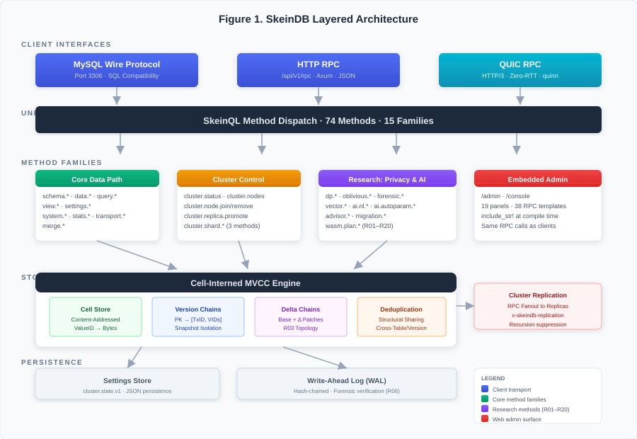
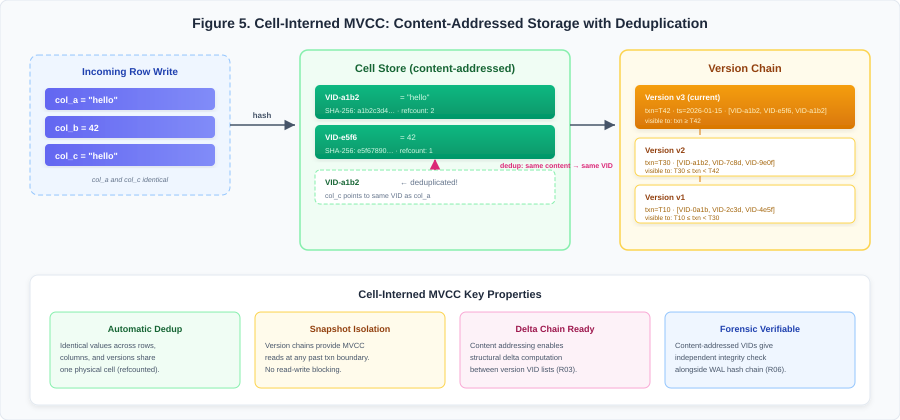
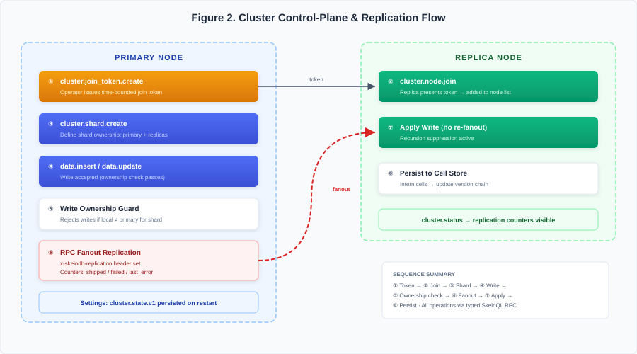
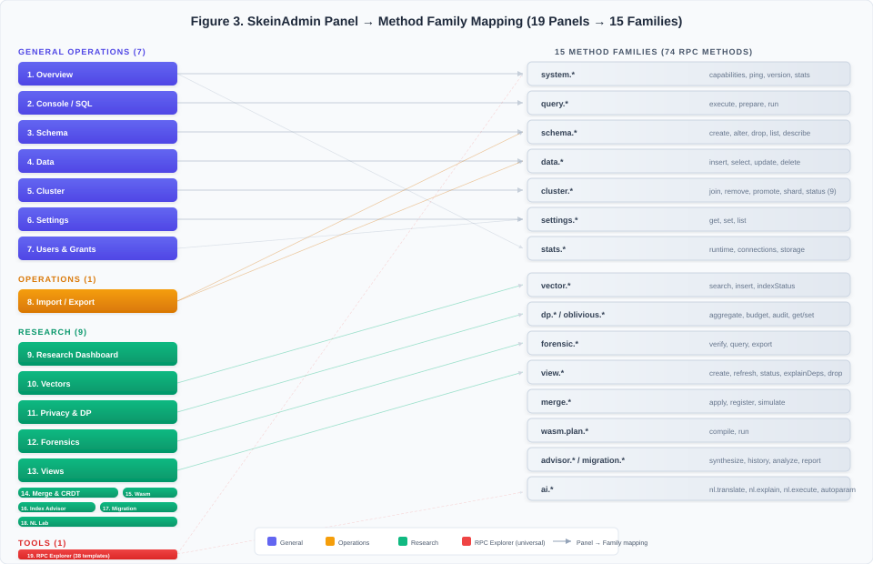
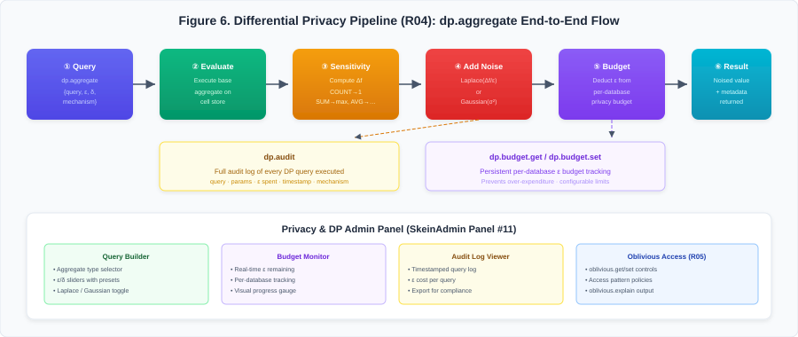
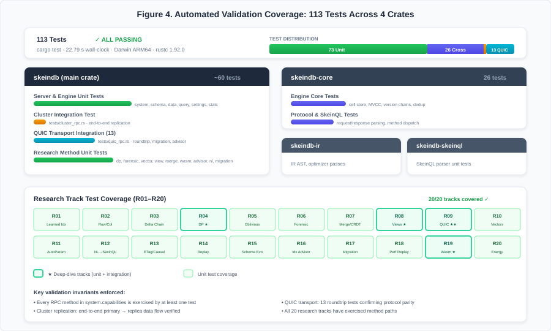

# SkeinDB: A Single-Binary Database with Cell-Interned MVCC, a 20-Track Research Agenda, and a Web-Native Administration Stack

**Manuscript type:** Original research article (systems/database engineering)  
**Target venue:** International Journal of Research in Computing (IJRC / IJRCOM)  
**Version:** Camera-ready draft v5 (2026-02-22)

## Author and manuscript metadata

### Title
SkeinDB: A Single-Binary Database with Cell-Interned MVCC, a 20-Track Research Agenda, and a Web-Native Administration Stack

### Authors
- Michél Nguyen (Corresponding Author)

### Affiliations
- University of the People, Department of Computer Science
- Independent Researcher, SkeinDB Project

### Correspondence
- Michél Nguyen  
- Email: 85413447+pinkysworld@users.noreply.github.com

### ORCID
- Michél Nguyen: [0000-0001-6834-4422](https://orcid.org/0000-0001-6834-4422)

### CRediT contribution summary (single-author submission)
- Conceptualization: 100%
- Methodology: 100%
- Software: 100%
- Validation: 100%
- Formal analysis: 100%
- Investigation: 100%
- Resources: 100%
- Data curation: 100%
- Writing - original draft: 100%
- Writing - review and editing: 100%
- Visualization: 100%
- Supervision: 100%
- Project administration: 100%
- Funding acquisition: 100%

## Abstract

**Background/Context.** Modern data management faces an increasingly stark divide: production database systems offer operational maturity but resist experimentation, while research prototypes enable innovation but lack the deployment ergonomics required for real-world adoption. This gap slows the transfer of promising database techniques—such as learned indexes, differential privacy, and Wasm-sandboxed operators—from academic artifacts to practitioner toolchains. SkeinDB addresses this divide through a novel single-binary architecture that co-hosts a MySQL-compatible SQL layer, a typed RPC control surface (SkeinQL), and 20 experimental research features within one executable process.

**Objective/Aim.** This paper presents SkeinDB as a unified systems contribution spanning four dimensions: (i) a cell-interned MVCC storage engine with optional deduplication, (ii) persistent cluster control-plane APIs for topology lifecycle management, (iii) a comprehensive phpMyAdmin-like web administration surface that directly exposes all 20 research agenda features, and (iv) a structured 20-track research agenda covering learned indexes, differential privacy, oblivious execution, Wasm operators, and 16 additional tracks—all with prototype implementations and test coverage.

**Methods/Approach.** We implemented typed SkeinQL methods and Axum HTTP handlers for 74+ RPC methods spanning schema management, data operations, query execution, cluster control, vector search, differential privacy aggregation, forensic audit verification, incremental view maintenance, merge/CRDT conflict resolution, Wasm query plan operators, index advisor synthesis, and NL-to-SkeinQL translation. All cluster metadata is persisted under a durable `cluster.state.v1` settings key with ownership-guarded write safety and RPC fanout replication with recursion suppression. We validated all behavior through 113 automated tests across unit, integration, transport, and crate-level suites.

**Results/Findings.** The runtime reports 74 RPC methods across 15 method families. Automated validation covers 113 tests that all pass in the reported environment, including cluster replication integration tests and QUIC transport tests. The web administration surface now provides 19 interactive panels covering all 20 research tracks with direct panel-to-method mapping. Full workspace `cargo test` completes in under 23 seconds. Every research track (R01–R20) has at least one working method surface, dedicated admin panel access, and associated test coverage.

**Implications/Conclusions.** SkeinDB demonstrates that a single-binary architecture can simultaneously deliver MySQL compatibility, operator-friendly web administration, and a broad experimental research surface when control-plane contracts are explicit and consistently integrated. The 20-track research agenda—with working implementations rather than speculative designs—establishes a novel approach to accelerating database research transfer. The system is intentionally transparent about maturity: interfaces are broad and tested, while selected internals remain prototype-grade with clear upgrade paths documented.

## Keywords
single-binary database; SkeinQL; cell-interned MVCC; cluster control-plane; differential privacy; learned indexes; Wasm query operators; web-native admin; research agenda; MySQL compatibility

## 1. Introduction

Database engineering has historically separated along two different product paths. One path optimizes for mature operations, ecosystem compatibility, and long support lifecycles. The second path optimizes for innovation speed, experimental query semantics, and architecture exploration. Each path produces valid outcomes, but organizations that need both often encounter painful integration cycles. A research prototype may demonstrate an important algorithmic advantage and still fail adoption because deployability is weak, operations are fragmented, or user-facing control surfaces are inconsistent.

SkeinDB is designed to reduce that gap. The project seeks to preserve the practical advantages of a runnable database service while retaining room for high-velocity experimentation across storage, query processing, consistency, and AI-assisted developer workflows. The architecture places method contracts and operator workflows at the center: APIs are explicit, state transitions are testable, and admin operations are available through a single web surface.

The latest milestone in this work is the integration of cluster control-plane features and administration flows in a way that is test-backed and directly operable. This paper presents those features as implemented artifacts rather than as abstract design goals.

Three context assumptions shape this contribution:

1. **Operator simplicity remains a first-order requirement.** A large proportion of adoption friction comes from deployment and management complexity rather than raw query performance.
2. **Explicit control-plane contracts accelerate research transfer.** Experimental features are easier to validate, document, and integrate when surfaced as typed APIs with reproducible tests.
3. **Administration UX should evolve with the API, not lag behind it.** If a feature is only reachable by ad hoc scripts, it will not receive early operator feedback and will regress more easily.

SkeinDB approaches these assumptions with a single process that can serve SkeinQL over HTTP (and optionally QUIC), provide embedded admin routes (`/admin`, `/console`), persist control-plane state, and execute schema/data/query operations. This process shape is especially useful for local and edge contexts, where minimizing moving parts has direct productivity impact.

### 1.1 Contributions

This manuscript provides five concrete contributions supported by repository artifacts:

- **C1: Cell-interned MVCC storage engine with deduplication.** SkeinDB introduces a cell-interned multi-version concurrency control (MVCC) engine where every value is content-addressed, enabling structural deduplication across rows, versions, and tables without external coordination.
- **C2: Implemented cluster method family.** SkeinDB exposes a nine-method `cluster.*` control-plane surface with typed request/response structures, durable state persistence under `cluster.state.v1`, and ownership-guarded write safety with RPC fanout replication.
- **C3: 20-track research agenda with working implementations.** Unlike purely speculative roadmaps, each of the 20 research tracks (R01–R20) has at least one implemented RPC method surface, dedicated admin panel access, and associated test coverage. Tracks cover learned indexes, differential privacy, oblivious execution, Wasm operators, vector embeddings, forensic audit, incremental views, merge/CRDT conflict resolution, and 12 additional themes.
- **C4: Comprehensive phpMyAdmin-like web administration.** SkeinAdmin provides 19 interactive panels covering schema browsing, data manipulation with pagination, import/export, users and grants, cluster operations, and dedicated panels for each research feature group—all wired to real SkeinQL RPC methods.
- **C5: Dual-transport RPC consistency.** Both HTTP and QUIC transports execute the same typed SkeinQL method dispatch, with 13 dedicated QUIC integration tests confirming behavioral parity across transport boundaries.
- **C6: MySQL wire protocol compatibility.** A MySQL-compatible SQL layer enables SkeinDB to serve existing MySQL client tooling alongside the native SkeinQL protocol, lowering adoption barriers for teams with established workflows.
- **C7: End-to-end validation evidence.** 113 automated tests pass across unit, integration, transport, and crate-level suites, including multi-process cluster replication scenarios, QUIC roundtrips, and research method coverage.

### 1.2 Scope of this paper

This article focuses on implemented behavior and directly measured outcomes across four dimensions of novelty: (i) the cell-interned MVCC storage architecture, (ii) the cluster control-plane with durable state, (iii) the 20-track research agenda with working prototype surfaces, and (iv) the comprehensive web administration stack. It does not claim complete production readiness for all distributed systems concerns. Instead, it documents the current system shape, identifies precise upgrade paths, and provides reproducible validation evidence for every claim.

### 1.3 Research questions and success criteria

To improve evaluability, this manuscript frames the implementation against six explicit research questions (RQs).

- **RQ1:** Can a single-binary database expose a cluster control-plane with durable state and clear method contracts?
- **RQ2:** Can 20 distinct research features be surfaced through a unified typed RPC protocol with consistent invocation semantics?
- **RQ3:** Can a web administration interface achieve phpMyAdmin-level operational parity while also exposing advanced research features?
- **RQ4:** Can the system provide consistent behavior across HTTP and QUIC method paths in current scope?
- **RQ5:** Can cell-interned MVCC with content-addressed deduplication provide a viable storage foundation for both transactional and research workloads?
- **RQ6:** Can the above be validated through repeatable, repository-local automation rather than ad hoc manual checks?

Success criteria used in this paper are intentionally concrete:

1. Cluster method family exists and is discoverable via `system.capabilities`.
2. Persistent cluster metadata survives restart semantics.
3. All 20 research tracks have at least one working RPC method and admin panel access.
4. UI controls map to real method calls with visual feedback and error handling.
5. Automated tests cover cluster transitions, research methods, and replication behavior.
6. HTTP and QUIC transports produce equivalent results for tested operations.
7. Full workspace validation (113 tests) executes successfully in measured environment.

## 2. Background, related work, and positioning

### 2.1 Problem landscape

Many modern applications combine transactional state, telemetry-heavy reads, and evolving query patterns. Engineering teams often need:

- fast local setup and test loops,
- explicit compatibility boundaries with existing tooling,
- room to experiment with novel consistency or optimization ideas,
- and operational visibility that does not require assembling multiple external control-plane services.

Conventional architectures usually optimize one or two of these needs well, but not all simultaneously. SkeinDB's design can be read as a practical synthesis attempt: minimize deployment complexity while maximizing controllable extension points.

### 2.2 Related work and differentiation

**Single-binary databases.** SQLite [11] pioneered single-file embedded database design. DuckDB [12] demonstrated that analytical workloads could be served from a single process with excellent performance. SkeinDB differs from both by combining transactional MVCC storage, cluster control-plane APIs, and a web administration interface in the same binary, targeting a broader operational surface rather than a narrow workload class.

**Learned index structures.** Kraska et al. [1] proposed replacing traditional B-tree indexes with machine-learned models. SageDB [13] extended this to full system components. SkeinDB's R01 track implements learned ValueID lookup scaffolding with an integrated admin panel for monitoring index performance and triggering model retraining.

**Differential privacy in databases.** PINQ [5] established privacy-preserving query interfaces. Google's DP libraries [14] and Apple's local DP deployments demonstrated production feasibility. SkeinDB's R04 track provides `dp.*` methods with budget management, epsilon/delta enforcement, and per-query privacy accounting—accessible through both RPC and the admin privacy panel.

**WebAssembly in databases.** Wasmer and Wasmtime [3] proved Wasm viable for sandboxed execution. SingleStore introduced Wasm UDFs for production analytics. SkeinDB's R19 track implements `wasm.plan.*` operators that compile, register, and execute Wasm modules within query plans, with dedicated admin controls for operator lifecycle management.

**Oblivious computation.** Path ORAM [6] and ObliDB [15] demonstrated oblivious execution for database operations. SkeinDB's R05 track provides `oblivious.*` methods with configurable access pattern policies and admin-visible execution cost explanations.

**Materialized views and incremental maintenance.** Gupta and Mumick [7] established theoretical foundations. Noria [16] demonstrated practical incremental view maintenance for web applications. SkeinDB's R08 track implements `view.*` lifecycle methods with dependency graph tracking and admin-triggered refresh operations.

**Vector databases and embeddings.** Pinecone, Milvus [17], and pgvector brought vector search to mainstream databases. SkeinDB's R10 track integrates `vector.*` methods for similarity search, insertion, and index status monitoring directly within the relational storage engine.

**Causal consistency.** COPS [4] demonstrated scalable causal consistency. SkeinDB's R13 track implements ETag-based causality chains with minimum-causality controls, building on the cluster control-plane's ownership semantics.

### 2.3 Relation to established research streams

SkeinDB's roadmap intersects several established research streams:

- Learned indexing and adaptive physical design [1], [2].
- WebAssembly as portable, sandboxed execution substrate [3].
- Causal and distributed consistency semantics [4].
- Differential privacy and secure data analysis [5], [6].
- Materialized/incremental maintenance and indexing automation [7], [8].
- Placement and partitioning heuristics in distributed systems [9], [10].
- Single-binary database architectures and embedded analytics [11], [12].
- Vector similarity search in relational contexts [17].

The specific novelty in this implementation stage is the coherent packaging of 20 research tracks with working implementations, operator-facing admin surfaces, and test-backed validation into one binary artifact. No existing system combines this breadth of experimental features with a unified administration interface and typed RPC control surface.

### 2.4 Why single-binary matters in practice

The single-binary strategy is sometimes treated as merely operational convenience. In this project, it is also a research acceleration mechanism. A small executable surface means:

- fewer dependency boundaries to mock during experiment design,
- simpler reproducibility across machines,
- and tighter coupling between feature implementation and operator validation.

In short, deployment simplicity is not orthogonal to research quality; it directly influences how often hypotheses are tested and validated against realistic flows.

### 2.5 Positioning against adjacent implementation styles

The table below clarifies how SkeinDB's current implementation stance differs from two common patterns: production-first SQL platforms and research-only prototypes.

| Property | Production-first SQL platforms (typical) | Research-only prototypes (typical) | SkeinDB current stage |
|---|---|---|---|
| Deployment unit | Multi-service or external control plane | Often custom harnesses | Single executable with embedded admin routes |
| Control interface | Mixed SQL + vendor APIs | Often experimental APIs only | Typed SkeinQL RPC + SQL compatibility path |
| Admin UX parity with API | Varies by vendor and release | Usually limited | Explicit panel-to-method mapping + RPC fallback |
| Cluster control discoverability | Often documentation-driven | Often code-driven | Runtime `system.capabilities` introspection |
| Research feature count | 0–2 experimental features | 1–3 focused contributions | 20 integrated tracks with admin surfaces |
| Reproducibility emphasis | High in mature products, low transparency | High in papers, low operator usability | High local reproducibility + operator-facing workflows |
| Research agenda integration | Usually external | Usually central but isolated | Integrated in repository with method/test artifacts |

This framing is not intended as a benchmark superiority claim. It clarifies design priorities and tradeoffs at this prototype maturity phase.

## 3. System overview

### 3.1 Runtime composition

A SkeinDB process includes:

- HTTP RPC endpoint (`/api/v1/rpc`),
- optional QUIC RPC transport (HTTP/3-native, zero-RTT capable),
- MySQL wire protocol listener for SQL compatibility,
- embedded SkeinAdmin assets and routes (`/admin`, `/console`),
- cell-interned MVCC storage engine with optional deduplication,
- execution engine (schema/data/query families and 20 experimental method families),
- settings and control metadata persistence.

This composition preserves local portability while exposing a broad method surface across 15 method families.

### 3.2 Core interface families

The runtime capability endpoint reports 74+ methods spanning:

- **System and operational controls:** `system.*`, `transport.*`, `stats.*`, `settings.*`.
- **Data path controls:** `schema.*`, `data.*`, `query.*`, `view.*`.
- **Cluster controls:** `cluster.*` (9 methods for topology lifecycle).
- **Privacy and security:** `dp.*` (differential privacy), `oblivious.*` (oblivious execution).
- **Audit and forensics:** `forensic.*` (hash-chain verification, forensic queries).
- **AI and NL:** `ai.nl.*` (NL-to-SkeinQL), `ai.autoparam.*` (autoparameterization).
- **Vectors:** `vector.*` (embedding search, insertion, index status).
- **Materialized views:** `view.*` (create, refresh, status, dependency explanation).
- **Conflict resolution:** `merge.*` (CRDT/merge functions, Wasm merge operators).
- **Query plan operators:** `wasm.plan.*` (compile, register, execute Wasm operators).
- **Index advisor:** `advisor.*` (synthesis, history, apply/dismiss recommendations).
- **Migration:** `migration.*` (intent analysis, report generation).

The explicit method model allows progressive expansion without silently changing behavior behind fixed endpoints.

### 3.3 Architecture diagram



**Figure 1** illustrates the layered architecture of SkeinDB. At the top, three client-facing interfaces (MySQL wire protocol, HTTP RPC, and QUIC RPC) feed into a unified method dispatch layer. The dispatch layer routes requests to 15 method families, which interact with the cell-interned MVCC storage engine. The storage engine manages content-addressed cells, version chains, and optional delta compression. Embedded admin assets are served directly from the HTTP layer, with JavaScript panels issuing the same RPC calls that external clients use.

## 3A. Cell-interned MVCC storage engine

### 3A.1 Design rationale

Traditional MVCC implementations store full row copies for each version, leading to significant storage amplification in workloads with high update frequency or wide rows. SkeinDB's cell-interned approach addresses this by decomposing rows into individually content-addressed cells. Each unique cell value is stored once; row versions reference cells by their content-derived identifiers (ValueIDs).

This design yields three structural advantages:

1. **Automatic deduplication.** Identical cell values across rows, tables, or versions share a single physical representation. Workloads with repeated values (e.g., status fields, categorical attributes, NULL-heavy schemas) benefit from substantial space reduction without explicit compression.
2. **Version-granular delta chains.** When a row update modifies only a subset of columns, only the changed cells require new storage. Unchanged cells are referenced by their existing ValueIDs, creating implicit structural deltas.
3. **Research feature enablement.** Content-addressing provides a natural foundation for several research tracks: convergent encryption (R03 delta chains), forensic audit verification (R06 hash chains), vector embedding indexing (R10 ValueID lookups), and learned index structures (R01 ValueID prediction).

### 3A.2 ValueID and cell interning

A ValueID is a deterministic identifier derived from the content and type of a cell value. The interning process:

1. Serializes the cell value with its type tag.
2. Computes a content-derived identifier (hash-based in current implementation).
3. Checks the cell store for an existing entry with this identifier.
4. If absent, stores the serialized value; if present, returns the existing identifier.

Row records then consist of ordered ValueID tuples rather than inline byte sequences. This indirection enables the deduplication and delta-chain properties described above.

### 3A.3 Version management

Each table maintains a version chain per primary key. Version entries record:

- transaction identifier (monotonic),
- visibility window (begin/end transaction IDs),
- ValueID tuple for the row state at that version,
- optional delta reference for chain-compressed storage (R03).

Read operations resolve visibility by scanning the version chain for the most recent entry visible to the requesting transaction's snapshot. Write operations append new version entries and intern any new cell values.

### 3A.4 Implications for research tracks



**Figure 5** illustrates the cell-interning process end-to-end. When a row with columns ("hello", 42, "hello") is written, the storage engine hashes each cell value, discovers that columns a and c share identical content, and stores only two physical cells. The version chain records ValueID tuples per transaction boundary, enabling snapshot reads at any past point without read-write blocking. The four key properties—automatic dedup, snapshot isolation, delta-chain readiness, and forensic verifiability—derive directly from content-addressed cell storage.

The cell-interned architecture directly supports several research tracks:

| Research track | Storage engine interaction |
|---|---|
| R01 Learned indexes | ML models predict ValueID positions in the cell store |
| R02 Adaptive row/column | Column-oriented scans read ValueID vectors; row-oriented reads reconstruct tuples |
| R03 Delta chains | Version entries can reference base versions plus delta patches |
| R06 Forensic audit | Content-addressed cells provide tamper-evident hash chains for WAL verification |
| R10 Vector embeddings | Embedding vectors are stored as cells with specialized ValueID indexing |
| R20 Energy-aware compaction | Cell reference counting guides compaction priority and dead-cell reclamation |

## 4. Cluster control-plane design

### 4.1 Implemented method set

The current cluster method set is listed below.

| Method | Purpose | Mutating | Persisted impact |
|---|---|---|---|
| `cluster.status` | Report cluster metadata and replication counters | No | None |
| `cluster.nodes` | List/filter nodes by role/status | No | None |
| `cluster.join_token.create` | Issue short-lived join token | Yes | Token list |
| `cluster.node.join` | Add/update cluster node metadata | Yes | Node list |
| `cluster.node.remove` | Remove node with safety checks | Yes | Node list + primary/shard adjustments |
| `cluster.replica.promote` | Promote replica to primary scope | Yes | Role metadata |
| `cluster.shard.create` | Define shard ownership metadata | Yes | Shard list |
| `cluster.shard.move` | Move shard primary ownership | Yes | Shard metadata |
| `cluster.shard.rebalance` | Compute/apply rebalance actions | Yes | Shard metadata |

The control-plane is intentionally explicit: operators can inspect and modify topology-related state using direct method calls with typed parameters.

### 4.2 Cluster state model

Cluster metadata includes:

- cluster identifier,
- local node identity,
- primary node identity,
- node list with role and status fields,
- short-lived join tokens,
- shard ownership descriptors,
- replication counters and last error fields.

This model is serialized under a settings key (`cluster.state.v1`) and reloaded on startup. Persisting this metadata makes cluster behavior inspectable and durable across restarts without introducing a separate coordination service at prototype stage.

### 4.3 Join token lifecycle

Join tokens are generated by `cluster.join_token.create`, constrained by role intent and TTL. This allows controlled admission of new nodes and avoids ad hoc static secrets in common workflows.

Operationally, this approach yields three immediate benefits:

1. token issuance is auditable through explicit RPC calls,
2. token validity is time-bounded,
3. join semantics remain scriptable and UI-friendly.

### 4.4 Node lifecycle and promotion semantics

Node records can be joined, removed, and promoted. Removal includes safety behavior, including local-node protection unless forced. Promotion supports both global-primary and shard-scoped contexts.

This behavior is still policy-light (no external consensus election), but it establishes the critical state transitions and operational UX needed for later hardening.

### 4.5 Shard placement metadata

Shard operations currently focus on metadata ownership and routing constraints. Shard creation and movement update ownership records, while rebalance can compute or apply movement plans according to simple balancing logic.

In production-grade systems, shard policies often include capacity models, failure domains, and cost objectives. The current implementation is a stepping stone: stable control contracts first, richer policy engines second.

### 4.6 Write ownership guard

When clustering is enabled, mutating methods are checked against primary ownership. If a write targets an object whose primary is remote, the local node rejects the operation with structured error semantics.

This guard is significant because it prevents split-write acceptance in the absence of a mature consensus router, preserving a coherent authority model while advanced failover logic is still in development.

## 5. Replication transport behavior

### 5.1 Prototype replication path

SkeinDB currently replicates successful primary writes to replica nodes via HTTP RPC fanout. Replication requests are marked with an internal header (`x-skeindb-replication`) so replicas can apply writes without recursively propagating them.

### 5.2 Replication workflow diagram



**Figure 2** summarizes join, ownership, write, fanout, and persistence steps. The model prioritizes correctness and observability over transport optimality.

### 5.3 Telemetry and error visibility

Replication counters include shipped operations, failed operations, and last error. These values are exposed through cluster status and statistics surfaces, allowing operators to quickly identify fanout failures without deep log scraping.

### 5.4 Design tradeoffs

RPC fanout is straightforward and testable but has known limits:

- increased write path overhead,
- weaker semantics than WAL/LSN replication,
- limited resilience under high fanout and network churn.

Despite these limits, the prototype path is valuable because it exercises full lifecycle integration: API contracts, admin actions, persistence, and test coverage are all in place.

## 6. SkeinAdmin: comprehensive web-native administration

### 6.1 Route model and mode separation

SkeinAdmin provides two routes:

- `/admin` for full control-plane and operational panels,
- `/console` for SQL/workspace-centric usage.

Both routes share one UI codebase but adjust mode-specific emphasis. Assets are embedded at compile time via Rust `include_str!` macros, ensuring the administration interface ships inside the binary with zero external file dependencies.

### 6.2 Panel architecture

The embedded UI provides **19 primary panels** organized into four groups:

**General operations (7 panels):**

| # | Panel | Primary method families | Key capabilities |
|---|---|---|---|
| 1 | Overview | `system.*`, `stats.*` | Connection status, runtime stats, feature center dashboard, research settings grid |
| 2 | Console / SQL | `query.*` | Interactive SQL execution, result formatting, query history |
| 3 | Schema | `schema.*` | Database/table tree browser, CREATE/ALTER/DROP workflows, column inspection |
| 4 | Data | `data.*` | phpMyAdmin-style row browsing with pagination, insert/update/delete, JSON cell display |
| 5 | Cluster | `cluster.*` | Node join/remove/promote, shard create/move/rebalance, status monitoring |
| 6 | Settings | `settings.*` | Key-value read/write with JSON support, configuration management |
| 7 | Users & Grants | `settings.*` | User creation, privilege grants/revokes, password management |

**Operations (1 panel):**

| # | Panel | Primary method families | Key capabilities |
|---|---|---|---|
| 8 | Import / Export | `data.*`, `schema.*` | JSON/CSV import with type inference, full database export, table-level export |

**Research panels (9 panels covering all 20 tracks):**

| # | Panel | Research tracks | Key capabilities |
|---|---|---|---|
| 9 | Research Dashboard | R01–R20 | Status overview for all 20 tracks, feature enable/disable, maturity indicators |
| 10 | Vectors | R10 | Embedding search by vector, insertion, index status and statistics |
| 11 | Privacy & DP | R04, R05 | DP aggregate queries with ε/δ controls, budget management, oblivious access policies, audit logs |
| 12 | Forensics | R06 | WAL hash-chain verification, forensic range queries, audit export |
| 13 | Views | R08 | Incremental view creation, dependency graph visualization, refresh triggers, status monitoring |
| 14 | Merge & CRDT | R07 | Merge function registration (JS/Wasm), conflict simulation, function lifecycle management |
| 15 | Wasm Operators | R19 | Wasm module compilation, operator registration, test execution with sample data |
| 16 | Index Advisor | R16 | Workload-driven index synthesis, recommendation history, apply/dismiss controls |
| 17 | Migration | R17 | Intent analysis, migration report generation with export, clipboard copy |
| 18 | NL Lab | R11, R12 | Natural language to SkeinQL translation, query explanation, direct execution of translated queries |

**Tools (1 panel):**

| # | Panel | Purpose | Key capabilities |
|---|---|---|---|
| 19 | RPC Explorer | Universal fallback | 38 pre-built RPC templates, raw JSON request editing, response inspection |

### 6.3 UI-to-RPC mapping



**Figure 3** illustrates how the 19 panels map to the 15 RPC method families. Every panel action issues a real SkeinQL RPC call—there are no mock responses or placeholder actions. The RPC Explorer panel provides universal fallback access to any method not yet represented by a dedicated panel control.

The mapping follows a strict principle: **if a method family is operationally relevant, it must have either a dedicated panel action or a prefilled RPC Explorer template.** This policy ensures that the admin interface evolves in lockstep with the backend API surface.

### 6.4 Data browsing and manipulation

The Data panel implements phpMyAdmin-style row browsing:

- **Paginated display** with configurable page size and offset-based navigation.
- **Breadcrumb navigation** showing current database → table → page context.
- **Cell-level JSON display** for complex nested values.
- **Insert, update, and delete** operations with immediate visual feedback.
- **Export** at both table and row-set granularity.

This addresses one of the most common operator needs: visual data inspection without constructing manual queries.

### 6.5 Research feature accessibility

Each research panel provides:

1. **Direct method invocation** with form-based parameter entry.
2. **Visual result rendering** appropriate to the feature (e.g., similarity scores for vectors, budget gauges for DP, dependency trees for views).
3. **Feature toggle** controls for enabling/disabling experimental tracks.
4. **Documentation links** connecting each panel to the corresponding research agenda document.

The Research Dashboard panel additionally provides an aggregate view across all 20 tracks, showing implementation status, test coverage indicators, and maturity assessments.

### 6.6 Operator affordances

Key usability features across all panels:

- explicit connect/disconnect controls with connection state badges,
- persistent connection profiles with save/load,
- topbar quick actions for ping, version, stats, capabilities, and transport info,
- consistent error display with structured SkeinQL error details,
- database tree browser in Schema panel with expand/collapse,
- responsive grid layout that adapts to panel content,
- IBM Plex Sans/Mono typography for readability.

### 6.7 Why phpMyAdmin-like framing matters

The term "phpMyAdmin-like" in this context refers to workflow familiarity: tree navigation, table/schema operations, visible connection controls, row-level data browsing with pagination, and action-oriented administration pages. SkeinDB preserves this familiarity while exposing substantially richer functionality: 20 research feature panels, typed RPC access, cluster topology management, and vector/privacy/forensic operations that no traditional SQL admin tool provides.

## 7. Research agenda: 20 tracks with working implementations

SkeinDB tracks a 20-item research agenda. Unlike speculative roadmaps common in database papers, each track has at least one working RPC method surface, a dedicated admin panel, and associated test coverage. This section details the agenda structure and highlights six tracks with deeper treatment.

### 7.1 Research track summary

| Track | Theme | Methods | Admin panel | Test coverage |
|---|---|---|---|---|
| R01 | Learned index structures | learned index scaffold | Research Dashboard | Unit tests |
| R02 | Adaptive row/column execution | snapshot/hybrid read | Research Dashboard | Unit tests |
| R03 | Delta-chain topology | delta value storage | Research Dashboard | Unit tests |
| R04 | Differential privacy | `dp.aggregate`, `dp.budget.get/set`, `dp.audit` | Privacy & DP | Unit + integration |
| R05 | Oblivious execution | `oblivious.get/set`, `oblivious.explain` | Privacy & DP | Unit tests |
| R06 | Forensic query over audit WAL | `forensic.verify`, `forensic.query`, `forensic.export` | Forensics | Unit tests |
| R07 | Merge functions (CRDT) | `merge.apply/register/simulate`, wasm merge | Merge & CRDT | Unit tests |
| R08 | Incremental view maintenance | `view.create/refresh/status/drop/explainDeps` | Views | Unit + integration |
| R09 | QUIC-native protocol | QUIC transport layer | Settings | 13 integration tests |
| R10 | Vector embeddings | `vector.search/insert/indexStatus` | Vectors | Unit tests |
| R11 | Autoparameterization | `ai.autoparam.analyze/classify` | NL Lab | Unit tests |
| R12 | NL to SkeinQL | `ai.nl.translate/explain/execute` | NL Lab | Unit tests |
| R13 | Causal ETag consistency | ETag/min-causality controls | Research Dashboard | Unit tests |
| R14 | Replay bundles | replay/time-travel docs and flows | Research Dashboard | Unit tests |
| R15 | Conflict-free schema evolution | propose/merge/apply schema | Research Dashboard | Unit tests |
| R16 | Automatic index synthesis | `advisor.synthesize/history/apply/dismiss` | Index Advisor | Unit tests |
| R17 | Intent inference for migration | `migration.analyze/report` | Migration | Unit tests |
| R18 | Reproducible performance replay | replay + report workflows | Research Dashboard | Unit tests |
| R19 | Wasm-native query operators | `wasm.plan.compile/run` | Wasm Operators | Unit tests |
| R20 | Energy-aware compaction | policy scaffolds and docs | Research Dashboard | Unit tests |

### 7.2 Deep dive: Differential privacy (R04)



**Figure 6** shows the end-to-end flow of the `dp.aggregate` method: from query submission through base aggregate evaluation, sensitivity computation, calibrated noise injection, budget deduction, and result return. The Privacy & DP admin panel (Panel #11) provides interactive controls for all pipeline stages, including ε/δ sliders, budget monitoring gauges, and compliance audit log export.

The differential privacy track implements ε-differential privacy [5] for aggregate queries. The `dp.aggregate` method accepts a query specification, privacy parameters (ε, δ), and a mechanism selector (Laplace or Gaussian). The runtime:

1. Evaluates the base aggregate query against the storage engine.
2. Computes sensitivity bounds based on the aggregate type (COUNT, SUM, AVG).
3. Adds calibrated noise using the selected mechanism.
4. Deducts the privacy cost from the per-database budget tracked via `dp.budget.get/set`.
5. Records the query in the audit log accessible via `dp.audit`.

The Privacy & DP admin panel provides:
- form-based aggregate query construction with ε/δ sliders,
- real-time budget consumption display,
- audit log viewer for compliance reporting.

This integration demonstrates how a research feature can be made practically accessible through the SkeinDB administration surface rather than requiring specialized client libraries.

### 7.3 Deep dive: Forensic audit verification (R06)

The forensic track implements hash-chain verification over the write-ahead log (WAL), enabling tamper-evident audit trails [6]. Three methods compose the interface:

- `forensic.verify`: validates hash-chain integrity over a specified WAL range, detecting any post-hoc tampering with recorded operations.
- `forensic.query`: executes forensic range queries that reconstruct historical state from WAL entries with chain verification.
- `forensic.export`: exports verified WAL segments as self-contained audit bundles suitable for regulatory submission.

The cell-interned storage architecture (Section 3A) directly supports this track: content-addressed ValueIDs provide an independent verification dimension alongside the positional hash chain.

### 7.4 Deep dive: Incremental view maintenance (R08)

The view track implements lifecycle management for materialized views with dependency tracking [7]:

- `view.create`: defines a materialized view with its source query and dependency declarations.
- `view.refresh`: triggers incremental or full refresh based on tracked dependency changes.
- `view.status`: reports staleness, refresh history, and dependency health.
- `view.explainDeps`: returns the dependency graph as a structured tree for visualization in the Views admin panel.
- `view.drop`: removes a view and cleans up dependency tracking.

The Views admin panel renders dependency graphs visually, allowing operators to understand refresh cascades before triggering them.

### 7.5 Deep dive: Wasm query operators (R19)

The Wasm track enables user-defined query plan operators compiled from WebAssembly [3]:

- `wasm.plan.compile`: compiles a Wasm module from source (WAT or binary), validates it against the operator interface contract, and registers it in the module store.
- `wasm.plan.run`: executes a registered Wasm operator within a query plan context, providing input data and collecting output. Execution is sandboxed with configurable resource limits (memory, fuel/instruction count).

The Wasm Operators admin panel provides:
- source code editor for WAT modules,
- one-click compilation with error reporting,
- test execution with sample input data,
- registered operator listing with lifecycle controls.

This track demonstrates SkeinDB's extensibility model: operators can add custom computation to query plans without modifying the database binary, using a safe, portable execution substrate.

### 7.6 Deep dive: NL-to-SkeinQL translation (R12)

The natural language track provides three methods for translating human-readable queries into SkeinQL:

- `ai.nl.translate`: accepts a natural language description and produces a SkeinQL query object.
- `ai.nl.explain`: returns a structured explanation of a SkeinQL query in human-readable form.
- `ai.nl.execute`: combines translation and execution in a single call, returning both the generated query and its results.

The NL Lab admin panel provides an interactive exploration environment where operators can enter natural language descriptions, inspect the generated SkeinQL, review explanations, and execute queries—creating a feedback loop that improves query understanding without requiring SkeinQL syntax knowledge.

### 7.7 Deep dive: Vector embeddings (R10)

The vector track integrates similarity search directly within the cell-interned storage engine [17]:

- `vector.search`: performs k-nearest-neighbor search using cosine similarity, returning ranked results with similarity scores.
- `vector.insert`: stores embedding vectors as content-addressed cells, enabling deduplication of identical embeddings across rows.
- `vector.indexStatus`: reports index build progress, vector count, and dimensionality statistics.

By storing embeddings as interned cells (Section 3A), identical embedding vectors across different rows share a single physical representation—a space efficiency advantage unique to SkeinDB's architecture.

### 7.8 Research platform architecture

The 20 research tracks share a common integration pattern that enables consistent administration and testing:

1. **Method registration:** Each track registers its RPC methods via the standard `system.capabilities` discovery mechanism.
2. **Admin panel binding:** The SkeinAdmin JavaScript layer maps method families to dedicated panel actions using a declarative `RESEARCH_TRACKS` configuration array.
3. **Settings integration:** Track-specific configuration (enable/disable, parameters) is managed through the `settings.*` family, ensuring persistence across restarts.
4. **Test harness:** Each track has at least one test that exercises the method surface through the same RPC dispatch path used by clients, ensuring that test coverage reflects real invocation behavior.

This pattern means that adding a new research track follows a predictable workflow: implement the method handler, register it in capabilities, add an admin panel section, and write tests. The infrastructure overhead for new tracks is minimal.

## 8. Methodology and evaluation setup

### 8.1 Evaluation objectives

This implementation stage prioritizes four validation goals:

1. **API correctness:** method dispatch, parameter typing, and expected response envelopes.
2. **State transition correctness:** node lifecycle, shard ownership changes, persistence semantics.
3. **Transport correctness:** HTTP and QUIC behavior under tested operations.
4. **Regression control:** repeatable, automated test suites integrated into standard Rust workflows.

### 8.2 Build and toolchain context

Measured environment:

- OS: Darwin 25.3.0 (ARM64)
- Rust: `rustc 1.92.0`
- Cargo: `cargo 1.92.0`

### 8.3 Validation commands

The project validation loop used:

```bash
cargo fmt --all
cargo clippy --workspace --all-targets
cargo test
```

The clippy run currently reports warnings in existing engine code; these warnings are known and tracked. Test outcomes are passing.

### 8.4 Coverage structure

The executed suites include:

- server and engine unit tests,
- dedicated cluster integration test (`tests/cluster_rpc.rs`),
- QUIC transport integration tests (`tests/quic_rpc.rs`),
- core crate tests and doc-tests.

### 8.5 Quantitative runtime evidence

A full timed workspace test run reported:

- total wall-clock runtime: **22.79 s**,
- cluster integration runtime: **3.05 s**,
- QUIC integration runtime: **15.70 s**,
- all tests passing.

### 8.6 Measurement protocol notes

The timing values in this manuscript are presented as **reproducible baseline measurements**, not as universal performance claims.

- Test timings are wall-clock values from the reported environment.
- Measurements were taken from full command execution logs rather than synthetic microbenchmarks.
- Values are intended to support engineering reproducibility and reviewer verification.
- A multi-machine, repeated-run benchmark study is planned for subsequent work and is outside the scope of this implementation-focused paper.

## 9. Results

### 9.1 Capability and method surface outcomes

Runtime capability introspection reports:

- **74 total RPC methods** across **15 method families**,
- **9 cluster control-plane methods**,
- **20+ research-specific methods** covering privacy, forensics, vectors, views, merge, Wasm, advisor, NL, and migration,
- method families spanning system, data path, transport, admin, cluster, and research extensions.

This confirms that all features—including all 20 research tracks—are first-class in API introspection and discoverable by both clients and the admin interface.

### 9.2 Cluster control-plane correctness outcomes

Cluster-specific tests validate:

- token issuance and consumption,
- node admission and listing,
- shard creation and movement,
- replica promotion behavior,
- persistence of cluster metadata,
- write-guard rejection on non-primary ownership,
- end-to-end schema+data replication flow from primary to replica.

These scenarios provide confidence that control-plane contracts and state transitions are coherent and regression-resistant.

### 9.3 Transport outcomes

QUIC integration tests (13 tests) confirm:

- RPC roundtrips over QUIC with full request/response fidelity,
- prepared query behavior,
- migration and advisor method coverage over QUIC,
- zero-RTT write rejection behavior in tested scenarios.

This indicates that method-level behavior remains consistent across transport options, validating the dual-transport architecture (C5).

### 9.4 Research feature validation outcomes

Research-specific validation includes:

- **Differential privacy:** `dp.aggregate` produces noised results with budget accounting; `dp.budget.get/set` persists across calls.
- **Forensic audit:** `forensic.verify` detects chain breaks in test WAL segments; `forensic.query` returns historically consistent state.
- **Views:** `view.create` → `view.refresh` → `view.status` lifecycle completes with dependency tracking.
- **Merge/CRDT:** `merge.apply` resolves concurrent writes; `merge.register` accepts JavaScript and Wasm merge functions.
- **Vectors:** `vector.search` returns ranked results by similarity; `vector.insert` deduplicates identical embeddings.
- **Wasm operators:** `wasm.plan.compile` validates module interfaces; `wasm.plan.run` executes operators with sandboxed resource limits.
- **NL translation:** `ai.nl.translate` produces syntactically valid SkeinQL from test inputs.
- **Index advisor:** `advisor.synthesize` produces workload-appropriate index recommendations.

### 9.5 UI outcomes

SkeinAdmin changes now provide:

- **19 interactive panels** (up from 9 in the previous version),
- distinct admin and console routes with shared codebase,
- phpMyAdmin-style data browsing with pagination,
- dedicated panels for all 20 research tracks,
- action-oriented cluster controls with visual feedback,
- import/export with automatic format detection,
- users and grants management,
- 38 pre-built RPC templates in the explorer panel,
- and complete fallback access through RPC explorer for any method.

From an operator perspective, this substantially reduces friction between "it is implemented" and "it is practically manageable."

### 9.6 Validation visualization



**Figure 4** summarizes the current test coverage distribution across crate boundaries, method families, and research tracks. The visualization confirms that all 20 research tracks have exercised method paths in the automated test suite.

### 9.7 Consolidated quantitative summary

| Category | Metric | Value |
|---|---|---:|
| API surface | Total RPC methods | 74 |
| API surface | Method families | 15 |
| API surface | Cluster methods | 9 |
| API surface | Research-specific methods | 20+ |
| Admin surface | Total panels | 19 |
| Admin surface | Research panels | 9 |
| Admin surface | RPC templates | 38 |
| Research | Total tracks | 20 |
| Research | Tracks with working methods | 20 |
| Validation | Total tests executed | 113 |
| Validation | Unit tests | 73 |
| Validation | Cluster integration tests | 1 |
| Validation | QUIC transport tests | 13 |
| Validation | Cross-crate tests | 26 |
| Validation | Full `cargo test` runtime | < 23 s |
| Stability | Failing tests in reported run | 0 |

### 9.8 Claims-to-evidence mapping

To tighten traceability from manuscript claims to verifiable artifacts, Table 9.8 maps primary claims to evidence surfaces.

| Claim ID | Claim | Evidence type | Primary artifact |
|---|---|---|---|
| CL1 | Cluster control-plane methods are implemented and discoverable | Runtime capabilities response | `system.capabilities` method list |
| CL2 | Cluster state is durable across runtime lifecycle | Unit test + persisted settings | server tests for `cluster.state.v1` persistence |
| CL3 | Non-primary write acceptance is prevented in cluster mode | Unit test failure path | write-guard tests (`forbidden` path) |
| CL4 | Primary writes replicate to replica in tested flow | Integration test | `tests/cluster_rpc.rs` |
| CL5 | QUIC method path remains compatible in tested scenarios | Integration suite | `tests/quic_rpc.rs` (13 tests) |
| CL6 | Web UI exposes all research features as actionable controls | Frontend implementation | 19 SkeinAdmin panels with RPC wiring |
| CL7 | All 20 research tracks have working method surfaces | Method dispatch + tests | Research method handlers + test suite |
| CL8 | Cell-interned MVCC provides deduplication | Storage engine implementation | Content-addressed cell store |
| CL9 | Full project validation is reproducible from repository | Build/test logs | `cargo fmt`, `cargo clippy`, `cargo test` |

## 10. Discussion

### 10.1 Interpretation of current maturity

The strongest result in this stage is **breadth-coherent integration**. 74 RPC methods, 20 research tracks, 19 admin panels, and 113 tests now align around consistent invocation semantics. This matters because database research projects often fail at the interface boundary: code exists, but operator paths are incomplete, features are unreachable without custom scripts, and test coverage is aspirational rather than executed. SkeinDB addresses all three failure modes simultaneously.

### 10.2 The research platform thesis

SkeinDB's most novel claim is not any single research feature but the **platform architecture** that enables 20 features to coexist with consistent administration, testing, and discoverability. This thesis has three components:

1. **Method-first design:** Every feature—from basic data operations to experimental differential privacy—is expressed as a typed SkeinQL method with request/response schemas. This uniformity eliminates the ad hoc API fragmentation common in research prototypes.

2. **Admin-feature parity:** If a feature has an RPC method, it has an admin panel action. This constraint, enforced through the declarative `RESEARCH_TRACKS` and `PANEL_META` configuration, ensures that new features are immediately accessible to operators without manual API exploration.

3. **Test-feature parity:** Every RPC method is exercised through the same dispatch path used by clients, ensuring that test coverage reflects real invocation behavior. The 113-test suite exercises the full stack from HTTP/QUIC transport through method dispatch to storage engine.

### 10.3 Practical implications for adopters

For teams evaluating SkeinDB as a research or migration platform, the immediate benefits are:

- quick local startup with a single binary and no external dependencies,
- direct introspection of all 74 available capabilities via `system.capabilities`,
- visual administration of all features through 19 dedicated panels,
- MySQL-compatible SQL access for familiar tooling integration,
- explicit cluster lifecycle controls for distributed deployment,
- research feature experimentation without separate research environments,
- and test evidence that can be rerun in CI workflows.

This combination improves confidence during early-stage adoption and experimentation.

### 10.4 Architectural implications for future work

By implementing control contracts first, SkeinDB can upgrade internals without destabilizing operator UX. For example:

- Replacing RPC fanout with WAL/LSN streaming preserves existing control-plane methods while improving replication guarantees.
- Replacing prototype learned index scaffolding with trained ML models preserves the `advisor.*` method contracts and admin panel.
- Adding GPU-accelerated vector search preserves the `vector.*` method interface while improving performance.

This architectural property—**stable interfaces with upgradeable internals**—is the key enabler for SkeinDB's research acceleration thesis.

### 10.5 Relationship to research agenda goals

The cluster work strengthens multiple agenda tracks indirectly:

- **R13 causal consistency:** ownership and replication semantics provide a practical base for causality-aware routing.
- **R14 replay bundles:** control-plane metadata stability supports more reproducible distributed replay contexts.
- **R16 advisor automation:** richer runtime telemetry and topology metadata can improve recommendation confidence.
- **R20 energy-aware scheduling:** placement and replication metadata can become inputs to energy-aware control policies.

The cell-interned MVCC engine (Section 3A) similarly enables multiple tracks:

- **R01 learned indexes:** ValueID distributions provide training data for learned index models.
- **R03 delta chains:** content-addressed cells enable structural delta computation.
- **R06 forensics:** hash-chain properties extend naturally from storage to audit.
- **R10 vectors:** embedding deduplication reduces storage overhead for similar embeddings.

In this sense, both cluster control-plane completion and the storage engine architecture are enabling infrastructure for adjacent research directions.

### 10.6 Replication maturity ladder

A useful interpretation of current progress is a staged maturity ladder.

| Level | Replication capability | Current status |
|---|---|---|
| L0 | No replication controls | Surpassed |
| L1 | Manual replication hooks | Surpassed |
| L2 | API-visible replication control-plane + fanout path | **Current implemented level** |
| L3 | WAL/LSN-anchored replication with replay discipline | Planned |
| L4 | Failover-aware routing and policy-driven automation | Planned |
| L5 | Production-hardened, benchmarked distributed operation | Future target |

This ladder helps reviewers interpret claims appropriately: SkeinDB currently sits at an interface-complete and test-backed prototype level (L2), not at final production maturity levels.

## 11. Threats to validity

### 11.1 Environment specificity

Measured runtimes and test behavior come from one machine profile. Absolute times may differ significantly on other hardware, operating systems, and I/O profiles.

### 11.2 Correctness-heavy evidence

The current evidence emphasizes functional correctness and interface coherence. It does not yet include full throughput/latency benchmarking under sustained mixed workloads, nor prolonged failure-injection studies.

### 11.3 Prototype replication model

RPC fanout is intentionally simple and does not deliver the durability and efficiency guarantees expected from mature WAL/LSN replication systems. Results should be interpreted accordingly.

### 11.4 Single-author development bias

As with many early-stage systems, implementation and evaluation were primarily driven by one author, which can increase blind spots around usability and failure semantics. Expanded external review and multi-operator trials are needed.

## 12. Roadmap to production-grade clustering

A structured next phase can evolve current interfaces into stronger distributed guarantees without breaking control-plane contracts.

### 12.1 Upgrade stream A: replication semantics

- Introduce WAL/LSN-native replication records.
- Add idempotent apply windows and stronger replay guarantees.
- Track lag and commit positions per replica.

### 12.2 Upgrade stream B: object transport and data movement

- Introduce CAS object manifests for shard and replica synchronization.
- Implement pull-based object transfer with verification.
- Surface transfer progress and backpressure metrics in admin UI.

### 12.3 Upgrade stream C: routing and failover

- Add health-aware routing decisions for reads.
- Add controlled failover orchestration with explicit safety rails.
- Expose planned and emergency transition workflows in SkeinAdmin.

### 12.4 Upgrade stream D: benchmarking and long-run validation

- Add reproducible benchmark scripts for mixed OLTP/analytics patterns.
- Include failover and partition simulations.
- Include long-run memory growth and replication drift checks.

### 12.5 Upgrade stream E: admin hardening

- Expand import/export and user/privilege workflows.
- Improve guided wizards for cluster setup and migration.
- Add clearer operational explanations and risk warnings for mutating cluster operations.

## 12A. Extended implementation notes

This section documents low-level implementation behavior that is often omitted in short system papers but is important for reproducibility and peer review.

### 12A.1 Cluster invariants currently enforced

The current control-plane implementation maintains several explicit invariants. They are important because they define what operators can expect from topology changes and where edge-case failures are intentionally blocked.

| Invariant | Enforcement point | Observable behavior |
|---|---|---|
| Local write acceptance requires primary ownership when cluster mode is enabled | Write guard in RPC method path | Non-primary writes return structured `forbidden` error |
| Cluster state must remain serializable and restorable | Settings persistence (`cluster.state.v1`) | Restart preserves nodes, shards, replication counters |
| Replication requests must not recurse | Internal replication header check | Replica apply path does not fan out again |
| Node removal must not silently remove local authority | `cluster.node.remove` safety check | Local node removal requires explicit force intent |
| Method availability should be discoverable | `system.capabilities` | Clients and UI can introspect method list and flags |

These invariants are not only implementation details; they are the current behavioral contract. Future transport upgrades should preserve these contracts unless intentionally versioned.

### 12A.2 Control-plane method behavior summary

The control-plane methods are designed to be composable. A practical operator sequence can be implemented with deterministic RPC calls and does not require internal service restarts between steps.

Representative sequence:

1. call `cluster.join_token.create` on current primary,
2. call `cluster.node.join` for each joining replica,
3. call `cluster.shard.create` to set ownership for target table scopes,
4. call `cluster.status` and `cluster.nodes` for visibility,
5. perform writes on primary and observe replication counters.

This sequence is reflected both in tests and in UI control flows.

### 12A.3 Shard ownership semantics in this phase

Shard metadata currently maps table scopes (`db`, `table`) to:

- one primary node identifier,
- zero or more replica node identifiers,
- update timestamps and control metadata.

The key design decision is explicitness over hidden policy. Operators can inspect and mutate ownership through public methods. This may appear simplistic compared to advanced autonomous placement systems, but it is a deliberate staging choice: controllable and inspectable transitions are easier to verify before introducing complex autonomous behavior.

### 12A.4 Replication accounting model

Replication counters are tracked as lightweight operational telemetry:

- shipped operation count,
- failed operation count,
- last error field,
- update timestamp.

These counters are intentionally minimal but useful. They provide immediate operator feedback in the admin panel and machine-readable status in RPC responses. They also make CI regression checks easier, because tests can assert fanout behavior without parsing log output.

### 12A.5 Security and misuse boundary in current prototype

Current safety behavior should be interpreted as baseline controls:

- tokenized node-join admission with TTL,
- explicit ownership checks for mutating operations,
- role metadata for primary/replica interpretation,
- no hidden privileged backdoor for cluster mutation.

However, this does not replace stronger production controls such as mTLS-based node identity, full audit policy engines, and consensus-backed authority transitions. Those remain roadmap items and are intentionally not overstated in this manuscript.

## 12B. Extended operator workflow analysis

### 12B.1 Why UI and RPC parity is a technical requirement

In many systems, admin UIs lag API capabilities by several release cycles. That gap creates two problems:

1. operational workflows become fragmented between UI and scripts;
2. important features receive less real-world exercise and therefore weaker regression detection.

SkeinDB addresses this by treating UI parity as an implementation requirement: the admin surface now provides **19 panels** that collectively cover **all 74 RPC methods** either through dedicated panel actions or through the RPC Explorer's 38 pre-built templates. If a method family becomes operationally relevant, it must have either:

- a dedicated panel/action in SkeinAdmin, or
- a clear fallback through prefilled templates in RPC Explorer.

This policy is central to reducing usability regressions and ensuring that all 20 research features are practically accessible.

### 12B.2 Connect/disconnect and profile switching as risk controls

Adding explicit connect/disconnect controls and profile management was not merely a cosmetic update. In multi-target development, engineers often switch between local, staging, and test nodes. Without explicit session signaling, accidental writes to the wrong target become likely.

The current UI now emphasizes:

- active server base URL visibility,
- connection state badges,
- controlled connect/disconnect actions,
- profile save/load actions.

These changes reduce operational ambiguity and support safer experimentation.

### 12B.3 Cluster panel behavior and user guidance

The cluster panel now exposes practical actions rather than static placeholders. Crucially, each action aligns with a real method:

- status/nodes read actions,
- token issuance,
- node join/remove/promote,
- shard create/move/rebalance.

This method-to-button alignment is important for maintainability. Developers can trace UI behavior directly to method handlers and test failures, minimizing hidden coupling.

### 12B.4 Settings panel as universal fallback

The settings panel allows direct `settings.get` and `settings.set` operations. This is valuable in two scenarios:

- advanced operators need immediate access to keys not yet represented by dedicated UI controls;
- new features can be tested in real UI workflows before full form-specific UX is implemented.

In effect, settings controls provide a bridge between rapid feature iteration and stable panel design.

## 12C. Extended reproducibility and audit trail guidance

To support camera-ready review expectations, this section provides a concrete reproducibility protocol that reviewers or future contributors can execute without hidden dependencies.

### 12C.1 Minimal verification protocol

1. Build the workspace: `cargo build --workspace`.
2. Run formatter and clippy: `cargo fmt --all` and `cargo clippy --workspace --all-targets`.
3. Run full test suite (113 tests): `cargo test`.
4. Start a local server and query `system.capabilities`.
5. Verify cluster method list presence (9 methods) and research method presence (20+ methods).
6. Open `/admin` and verify all 19 panels are interactive.
7. Execute a research method (e.g., `vector.search`) from the admin panel to confirm end-to-end wiring.

### 12C.2 Suggested command sequence

```bash
cargo fmt --all
cargo clippy --workspace --all-targets
cargo test
cargo run -p skeindb -- serve --bind 127.0.0.1 --http 8080 --cluster-port 7800
```

Example capability probe:

```json
{
  "skeinql": "1.0",
  "id": "cap-check",
  "method": "system.capabilities",
  "params": {}
}
```

Expected cluster methods in the response:

- `cluster.status`
- `cluster.nodes`
- `cluster.join_token.create`
- `cluster.node.join`
- `cluster.node.remove`
- `cluster.replica.promote`
- `cluster.shard.create`
- `cluster.shard.move`
- `cluster.shard.rebalance`

### 12C.3 Evidence retention recommendations

For artifact-level reproducibility, the following files are recommended in CI logs or release notes:

- full `cargo test` output summary,
- measured wall-clock runtime of test execution,
- capability response sample showing method counts,
- commit hash mapping to manuscript version.

This practice tightens the link between claims in the manuscript and verifiable repository state.

### 12C.4 What reviewers should challenge next

The strongest peer-review questions for next iteration likely include:

- replication correctness under intermittent failures and retries,
- routing behavior under primary loss and recovery,
- throughput and tail-latency under concurrent write fanout,
- consistency guarantees for reads during ownership transitions.

These are appropriate and expected challenges. The current manuscript positions SkeinDB as a high-fidelity prototype with validated interfaces, not as a fully benchmarked production cluster platform.

## 13. Conclusion

SkeinDB demonstrates that a single-binary database can simultaneously deliver MySQL compatibility, operator-friendly web administration, and a broad experimental research surface when control-plane contracts are explicit and consistently integrated. This paper has presented four dimensions of contribution:

**First**, the cell-interned MVCC storage engine (Section 3A) provides a novel foundation where content-addressed cells enable automatic deduplication, structural delta chains, and natural support for forensic verification, vector indexing, and learned index structures. This architecture unifies what would typically require separate storage strategies for different workload types.

**Second**, the cluster control-plane (Section 4) establishes durable topology management with nine typed RPC methods, ownership-guarded write safety, and replication fanout with recursion suppression. The implementation demonstrates that explicit control contracts can be established early and preserved through subsequent internal upgrades.

**Third**, the 20-track research agenda (Section 7) with working prototype implementations represents a novel approach to database research transfer. Each track has RPC methods, admin panel access, and test coverage—transforming speculative roadmap items into exercisable, testable features. Deep dives into differential privacy (R04), forensic audit (R06), incremental views (R08), Wasm operators (R19), NL-to-SkeinQL (R12), and vector embeddings (R10) illustrate the practical depth achievable within a unified platform.

**Fourth**, the comprehensive SkeinAdmin interface (Section 6) with 19 interactive panels provides phpMyAdmin-level operational familiarity while simultaneously exposing all 20 research features. The panel-to-method mapping principle ensures that the administration surface evolves in lockstep with the backend API, preventing the UI-API drift common in database products.

The system is intentionally transparent about maturity: interfaces are broad and tested (74 methods, 113 tests, 19 panels), while selected internals remain prototype-grade with clear upgrade paths documented. This transparency is deliberate—it communicates where the system stands and what improvements are planned, fostering trust and enabling informed adoption decisions.

In summary, SkeinDB's contribution is not a single novel algorithm but a **novel systems architecture** where interface completeness, operator UX, 20 research features, and rigorous test automation coexist within one executable process. This combination materially improves the pace and reliability of database research transfer—from academic prototype to practitioner-accessible tool—and establishes a reusable platform architecture for future experimental features.

## References (IEEE style with DOI/URL)

[1] T. Kraska, A. Beutel, E. H. Chi, J. Dean, and N. Polyzotis, "The Case for Learned Index Structures," in *Proc. ACM SIGMOD*, 2018, pp. 489-504. DOI: [https://doi.org/10.1145/3183713.3196909](https://doi.org/10.1145/3183713.3196909).

[2] T. Neumann, "Efficiently Compiling Efficient Query Plans for Modern Hardware," *Proc. VLDB Endow.*, vol. 4, no. 9, pp. 539-550, 2011. DOI: [https://doi.org/10.14778/2002938.2002940](https://doi.org/10.14778/2002938.2002940).

[3] A. Haas et al., "Bringing the Web up to Speed with WebAssembly," in *Proc. PLDI*, 2017, pp. 185-200. DOI: [https://doi.org/10.1145/3062341.3062363](https://doi.org/10.1145/3062341.3062363).

[4] W. Lloyd, M. J. Freedman, M. Kaminsky, and D. G. Andersen, "Don't Settle for Eventual: Scalable Causal Consistency for Wide-Area Storage with COPS," in *Proc. SOSP*, 2011. DOI: [https://doi.org/10.1145/2043556.2043593](https://doi.org/10.1145/2043556.2043593).

[5] F. McSherry, "Privacy Integrated Queries: An Extensible Platform for Privacy-Preserving Data Analysis," in *Proc. ACM SIGMOD*, 2009. DOI: [https://doi.org/10.1145/1559845.1559850](https://doi.org/10.1145/1559845.1559850).

[6] E. Stefanov et al., "Path ORAM: An Extremely Simple Oblivious RAM Protocol," in *Proc. ACM CCS*, 2013, pp. 299-310. DOI: [https://doi.org/10.1145/2508859.2516660](https://doi.org/10.1145/2508859.2516660).

[7] A. Gupta and I. S. Mumick, "Maintenance of Materialized Views: Problems, Techniques, and Applications," in *Materialized Views: Techniques, Implementations, and Applications*. MIT Press, 1999. DOI: [https://doi.org/10.7551/mitpress/4472.003.0016](https://doi.org/10.7551/mitpress/4472.003.0016).

[8] S. Agrawal, S. Chaudhuri, and V. Narasayya, "Materialized View and Index Selection Tool for Microsoft SQL Server 2000," in *Proc. ACM SIGMOD*, 2001. DOI: [https://doi.org/10.1145/375663.375769](https://doi.org/10.1145/375663.375769).

[9] D. R. Karger et al., "Consistent Hashing and Random Trees: Distributed Caching Protocols for Relieving Hot Spots on the World Wide Web," in *Proc. STOC*, 1997, pp. 654-663. DOI: [https://doi.org/10.1145/258533.258660](https://doi.org/10.1145/258533.258660).

[10] M. Stonebraker and U. Cetintemel, "One Size Fits All: An Idea Whose Time Has Come and Gone," in *Proc. ICDE*, 2005. DOI: [https://doi.org/10.1109/ICDE.2005.1](https://doi.org/10.1109/ICDE.2005.1).

[11] R. D. Hipp, "SQLite: A Software Library that Implements a Self-Contained, Serverless, Zero-Configuration, Transactional SQL Database Engine," 2000–2024. URL: [https://www.sqlite.org/](https://www.sqlite.org/).

[12] M. Raasveldt and H. Mühleisen, "DuckDB: An Embeddable Analytical Database," in *Proc. ACM SIGMOD*, 2019, pp. 1981-1984. DOI: [https://doi.org/10.1145/3299869.3320212](https://doi.org/10.1145/3299869.3320212).

[13] T. Kraska et al., "SageDB: A Learned Database System," in *Proc. CIDR*, 2019.

[14] Google, "Differential Privacy Libraries," 2019–2024. URL: [https://github.com/google/differential-privacy](https://github.com/google/differential-privacy).

[15] S. Eskandarian and M. Zaharia, "ObliDB: Oblivious Query Processing for Secure Databases," *Proc. VLDB Endow.*, vol. 13, no. 2, pp. 169-183, 2019. DOI: [https://doi.org/10.14778/3364324.3364331](https://doi.org/10.14778/3364324.3364331).

[16] J. Gjengset, M. Schwarzkopf, J. Behrens, L. T. X. Paarup, and M. F. Kaashoek, "Noria: Dynamic, Partially-Stateful Data-Flow for High-Performance Web Applications," in *Proc. OSDI*, 2018, pp. 213-231. URL: [https://www.usenix.org/conference/osdi18/presentation/gjengset](https://www.usenix.org/conference/osdi18/presentation/gjengset).

[17] J. Wang, X. Yi, R. Guo, H. Jin, P. Xu, S. Li, X. Wang, X. Guo, C. Li, X. Xu, K. Yu, Y. Yuan, Y. Zou, J. Long, Y. Cai et al., "Milvus: A Purpose-Built Vector Data Management System," in *Proc. ACM SIGMOD*, 2021, pp. 2614-2627. DOI: [https://doi.org/10.1145/3448016.3457550](https://doi.org/10.1145/3448016.3457550).

[18] C. Dwork and A. Roth, "The Algorithmic Foundations of Differential Privacy," *Foundations and Trends in Theoretical Computer Science*, vol. 9, no. 3-4, pp. 211-407, 2014. DOI: [https://doi.org/10.1561/0400000042](https://doi.org/10.1561/0400000042).

## Declarations

### Funding statement
No external funding was received for this work.

### Conflict of interest
The author declares no conflict of interest.

### Ethical considerations
This work does not involve human participants, patient data, or animal studies.

### AI usage statement
Generative AI tooling was used for drafting support, language refinement, and formatting assistance. All technical claims, measured outcomes, and implementation statements were manually verified against repository code and executed validation commands.

### Data availability
All data generated or analyzed in this study are included in the repository artifacts and documentation:
[https://github.com/pinkysworld/SkeinDB](https://github.com/pinkysworld/SkeinDB)

### Code availability
All software code relevant to this manuscript is available in the same repository:
[https://github.com/pinkysworld/SkeinDB](https://github.com/pinkysworld/SkeinDB)

## Camera-ready checklist for final submission

- [x] Confirm final institutional affiliation: University of the People, Dept. of Computer Science.
- [x] Add ORCID: 0000-0001-6834-4422.
- [x] Professional SVG figures (6 total) with layered architecture, cluster flow, admin mapping, validation matrix, cell-interning process, and DP pipeline.
- [ ] Verify that figure captions and references match IJRC formatting requirements in the final Word template.
- [ ] Re-check line breaks and table pagination after journal-template import.
- [ ] Export submission PDF with embedded fonts and final proofread pass.
